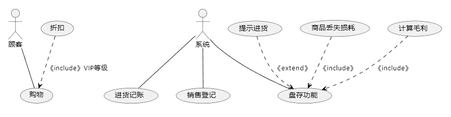
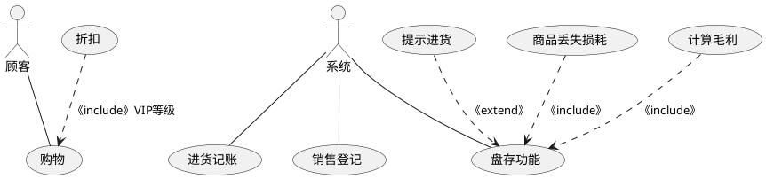

# 作业1

## 用例图

## 用例说明

| 用例编号 | A-001                                                                                                                           |
| -------- | ------------------------------------------------------------------------------------------------------------------------------- |
| 用例名称 | 进货记账                                                                                                                        |
| 参与者   | 系统                                                                                                                            |
| 用例描述 | 进货记账                                                                                                                        |
| 主事件流 | 1. 系统开始对进货物品记账，启动用例 2. 打开系统记账界面 3.记录进货信息 4.关闭进货界面 5. 记账完成，用例结束 |

| 用例编号 | A-002                                                                               |
| -------- | ----------------------------------------------------------------------------------- |
| 用例名称 | 销售登记                                                                            |
| 参与者   | 老板                                                                                |
| 用例描述 | 销售登记                                                                            |
| 主事件流 | 1. 系统开始对销售情况登记，启动用例 2. 登记销售情况 3. 登记完成，用例结束 |

| 用例编号 | A-003                                                                                                               |
| -------- | ------------------------------------------------------------------------------------------------------------------- |
| 用例名称 | 盘存功能                                                                                                            |
| 参与者   | 系统                                                                                                                |
| 用例描述 | 盘存功能                                                                                                            |
| 主事件流 | 1. 系统开始盘存，用例开始 2. 计算商品丢失损耗 3. 计算毛利 4. 盘存记录 5. 盘存记录完成，用例结束 |
| 扩展点   | 4A：提示进货 1. 系统发现库存不足 2. 提示进货                                                              |

| 用例编号 | A-004                                                                         |
| -------- | ----------------------------------------------------------------------------- |
| 用例名称 | 提示进货                                                                      |
| 参与者   | 系统                                                                          |
| 用例描述 | 提示进货                                                                      |
| 主事件流 | 1. 系统开始提示进货，用例开始 2. 弹窗提醒 3. 提示进货完成，用例结束 |

| 用例编号 | A-005                                                                                   |
| -------- | --------------------------------------------------------------------------------------- |
| 用例名称 | 商品丢失损耗                                                                            |
| 参与者   | 系统                                                                                    |
| 用例描述 | 商品丢失损耗                                                                            |
| 主事件流 | 1.系统开始计算丢失损耗，用例开始 2.计算丢失损耗 3. 计算丢失损耗完成，用例结束 |

| 用例编号 | A-006                                                                             |
| -------- | --------------------------------------------------------------------------------- |
| 用例名称 | 计算毛利                                                                          |
| 参与者   | 系统                                                                              |
| 用例描述 | 计算毛利                                                                          |
| 主事件流 | 1. 系统开始计算丢失损耗，用例开始 2. 计算毛利 3. 计算毛利完成，用例结束 |

| 用例编号 | B-001                                                                                                                     |
| -------- | ------------------------------------------------------------------------------------------------------------------------- |
| 用例名称 | 购物                                                                                                                      |
| 参与者   | 顾客                                                                                                                      |
| 用例描述 | 购物                                                                                                                      |
| 主事件流 | 1. 顾客开始购物，用例开始 2. 顾客选择对应商品 3. 根据顾客VIP等级获得折扣付款对应金额 4. 付款完成，用例结束 |

| 用例编号 | B-002                                                                  |
| -------- | ---------------------------------------------------------------------- |
| 用例名称 | 折扣                                                                   |
| 参与者   | 顾客                                                                   |
| 用例描述 | 根据顾客VIP等级获得对应折扣                                            |
| 主事件流 | 1. 获得顾客VIP等级，用例开始 2. 根据VIP等级返回对应折扣，用例结束 |

### 代码

