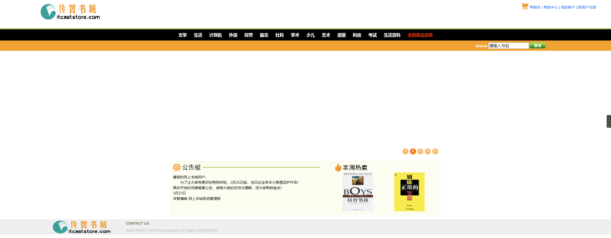
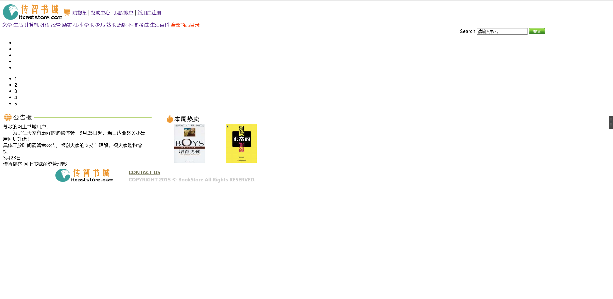
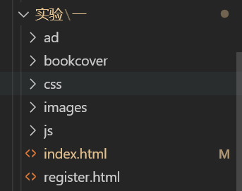
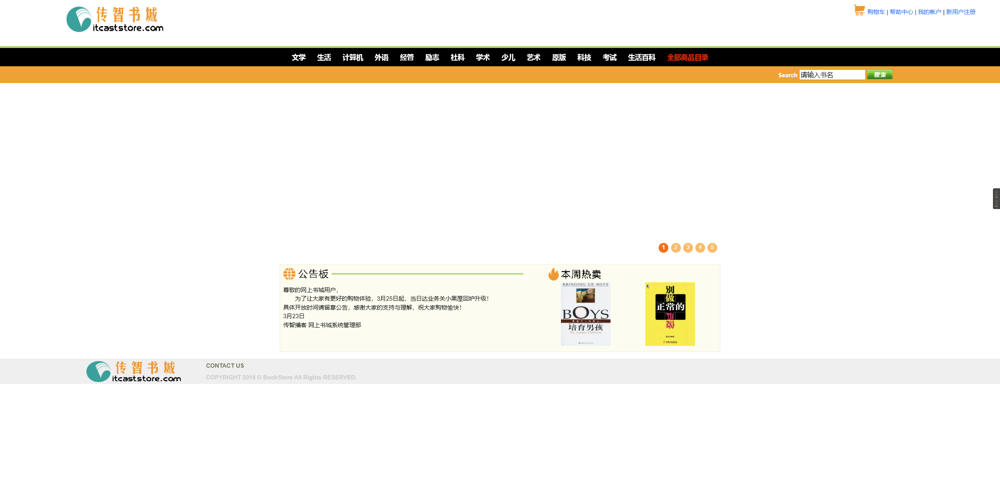

# 实验一：web客户端技术

## 一.实验目的

1. 掌握Dreamweaver、Code等工具的使用
2. 熟悉HTML的常用标记
3. 熟悉CSS选择器和常用属性
4. 掌握HTML+CSS+JavaScript的开发基础

## 二． 实验类型：验证型

---

## 三． 实验学时：12学时

---

## 四． 实验原理及知识点

---

1. HTML的常用标记包括文字与段落，建立列表，图片及多媒体文件的使用，建立超链接，建立表单页面
2. 页面的布局
3. 样式语法，样式属性，样式类
4. 脚本语言语法，HTML DOM模型，事件响应模型。

## 五．实验环境（硬件环境、软件环境）

---

1. 硬件环境：微型电子计算机Intel Pentium 4 CPU 1.2GHz，512MB RAM及以上
2. 软件环境:
   操作系统：Windows 7 以上
   Web服务器：Tomcat 8 以上
   数据库：MySQL 5 以上
   软件工具：Eclipse 4 集成开发工具/IDEA、Chrome浏览器

## 六．实验内容及步骤

---

### **1. 书城首页的实现**

#### **功能**

+ 布局（第一次上机课）
+ 水平菜单栏（第2次上机课）
+ 下拉菜单（第2次上机课）
+ 表格变色（第3次上机课）
+ 广告页轮播（第4次上机课）

#### **效果图**



#### 不使用css的效果图：



### **实验步骤**

**1）.创建资源文件夹
**2).布局****

* 写出HTML的分层各部分
* 为每个层布局，定义背景色和大小、定位（宽度、高度、框模型），局部通过table来设置位置
* divhead 头部区域通过table布局，创建一行两列的表格。

```html
  <!--网页上方的项目-->
<div id = divhead>
    <table cellspacing = "0" class = "headtable"> 
        <tr>
            <td>
                <a href="#">
                    
                </a>
            </td>
            <td style="text-align:right"><!--靠右对齐-->
                 <a href="#">购物车</a>
                <a href="#">帮助中心</a> 
                <a href="#">我的账户</a>
                <a href="register.html"><!--切换注册页面-->注册账户</a>
            </td>
        </tr>
    </table>
</div>
    <!--书店的上方项目结束-->
```

* divmenu菜单项布局

```css
    #divmenu {
	width: 100%;
	border-top-width: 4px;
	border-top-style: solid;
	border-top-color: #b4d76d;
	background-color: #000000;
	text-align: center;
	padding: 10px 0px 10px 0px;
	font-size: 14px;
}
```

* divsearch 一个输入框和一个查找按钮

```html
    <!--搜索书籍-->
<div id="divsearch">
    <form action="#" id="searchform">
        <table width="100%" border="0" cellspacing="0"><!--width为范围-->
            <tr>
                <td style="text-align:right; padding-right:200px">
                    <!--样式中 右内边距定位-->
                    <input type="text" name="textfield" class="inputtable" id="textfield" value="请输入要查找的书名"
                    onmouseover="this.focus();"
                    onclick="my_click(this, 'textfield');"
                    onblur="my_blur(this, 'textfield');" />
                    <a href ="#">
                        
                    </a>
                </td>
            </tr>
        </table>
    </form>
</div>
```


* box_autoplay轮播图 固定宽度和高度，左下角排列按钮

```css
box_autoplay {
    position: relative;
    width: 900px;
    height: 335px;
    background: #fff;
    border-radius: 5px;
    border:8px solid #fff;
	margin:10px auto;
	cursor:pointer;   
}

#box_autoplay .list {
    position: relative;
    width: 900px;
    height: 335px;
    overflow: hidden;
}

#box_autoplay .list ul {
    position: absolute; 
    top: 0;  
    left:0; 
}

#box_autoplay .list li { 
    width:900px; 
    height:335px; 
    overflow:hidden; 
}

#box_autoplay .count li {
	color:#fff;
	float:left;
	width:20px;
	height:20px;
	cursor:pointer;
	margin-right:5px;
	overflow:hidden;
	background:#F90;
	opacity:0.7;
	filter:alpha(opacity=70);
	border-radius:20px;
}

#box_autoplay .count li.current {
	color:#fff;
	opacity:1;
	filter:alpha(opacity=100);
	font-weight:700;
	background:#f60;
}

#tmp {
	width:100px;
	height:100px;
	background:red;
	position:absolute;
}
```

```

```

* divcontent  左边使用文本框，右边插入图片

```css
#divcontent {
    width: 900px;
    background-color: #FCFDEF;
    border: 1px solid #EEEDDB;
    MARGIN-RIGHT: auto;
    MARGIN-LEFT: auto;
    height: 250px;
}
```

* divfoot 底部一张图片和文本

```html
<!--5. 网上书城底部 start -->
<div id="divfoot">
    <table width="100%" border="0" cellspacing="0" >
        <tr>
            <td rowspan="2" style="width:10%">
                
            </td>
            <td style="padding-top:5px; padding-left:50px">
                <a href="#">
                    <font color="#747556"><b>CONTACT US</b></font> 
                </a>
            </td>
        </tr>
        <tr>
            <td style="padding-left:50px">
                <font color="#CCCCCC">
                    <b>COPYRIGHT 2015 © BookStore All Rights RESERVED.</b> 
                </font>
            </td>
        </tr>
    </table>
</div>

<!-- 网上书城底部  end -->

#divfoot {
    width: 100%;
    clear: both;
    background-color: #efefef;
    margin-top: 15px;
}
```

**3).菜单的实现**

```html
    <!--书店菜单-->
<div id="divmenu">
        <a href="#">文学</a>
        <a href="#">数学</a>
        <a href="#">语言</a>
        <a href="#">科学</a>
        <a href="#">悬疑</a>
        <a href="#">科幻</a>
        <a href="#">儿童</a>
        <a href="#">生活</a>
        <a href="#" style="color: red">全部商品目录</a>
    </tr>
</div> 
    <!--书店菜单结束-->
```

* 实现效果图：

**4).下拉菜单**

* 代码如下:

```html
<html>
<head>
    <title>下拉菜单实例</title>
    <script language="JavaScript">
        function show(menu) {
            document.getElementById(menu).style.visibility = "visible";
        }
        function hide() {
            document.getElementById("menu1").style.visibility =
                "hidden";
            document.getElementById("menu2").style.visibility =
                "hidden";
            document.getElementById("menu3").style.visibility = "hidden";
        }
    </script>
</head>
<body>
    <table>
        <tr bgcolor="#9999ff" align="center">
            <td width="120" onmousemove="show('menu1')" onmouseout="hide()">系列课程</td>
            <td width="120" onmousemove="show('menu2')" onmouseout="hide()">教学课件</td>
            <td width="120" onmousemove="show('menu3')" onmouseout="hide()">课程大纲</td>
        </tr>
    </table>
    <div id="menu1" onmousemove="show('menu1')" onmouseout="hide()"
        style="background: #9999ff;position:absolute;left:12px;top:38;width:120;visibility: hidden">
        <span>C++程序设计</span><br />
        <span>Java程序设计</span><br />
        <span>Python程序设计</span><br />
    </div>
    <div id="menu2" onmousemove="show('menu2')" onmouseout="hide()"
        style="background: #9999ff;position:absolute;left:137px;top:38;width:120;visibility: hidden">
        <span>C++课件</span><br />
        <span>Java课件</span><br />
        <span>Python课件</span><br />
    </div>
    <div id="menu3" onmousemove="show('menu3')" onmouseout="hide()"
        style="background: #9999ff;position:absolute;left:260px;top:38;width:120;visibility: hidden">
        <span>C++大纲</span><br />
        <span>Java大纲</span><br />
        <span>Python大纲</span><br />
    </div>
</body>
</html>
```

* 效果图:.png)
  **5).轮播图**
* 代码如下:

```html
    <!--推荐书籍轮播画面-->
<div id="box_autoplay">
    <div class="list">
        <ul>
            <li></li>
            <li></li>
            <li></li>
            <li></li>
            <li></li>
        </ul>
    </div>
</div>
```

* 在js中完成的部分:

```js
//获取ID
var $ = function (id) {return typeof id === "string" ? document.getElementById(id) : id;};
//获取tagName
var $$ = function (tagName, oParent) {return (oParent || document).getElementsByTagName(tagName);};
//自动播放对象
var AutoPlay = function (id) {this.initialize(id);};
AutoPlay.prototype = {
	initialize: function (id)
	{
		var oThis = this;
		this.oBox = $(id);
		this.oUl = $$("ul", this.oBox)[0];
		this.aImg = $$("img", this.oBox);
		this.timer = null;
		this.autoTimer = null;
		this.iNow = 0;
		this.creatBtn();
		this.aBtn = $$("li", this.oCount);
		this.toggle();
		this.autoTimer = setInterval(function ()
		{
			oThis.next();
		}, 3000);
		this.oBox.onmouseover = function ()
		{
			clearInterval(oThis.autoTimer);
		};
		this.oBox.onmouseout = function ()
		{
			oThis.autoTimer = setInterval(function ()
			{
				oThis.next();
			}, 3000);
		};
		for (var i = 0; i < this.aBtn.length; i++)
		{
			this.aBtn[i].index = i;
			this.aBtn[i].onmouseover = function ()
			{
				oThis.iNow = this.index;
				oThis.toggle();
			};
		}
	},
	creatBtn: function ()
	{
		this.oCount = document.createElement("ul");
		this.oFrag = document.createDocumentFragment();
		this.oCount.className = "count";
		for (var i = 0; i < this.aImg.length; i++)
		{
			var oLi = document.createElement("li");
			oLi.innerHTML = i + 1;
			this.oFrag.appendChild(oLi);
		}
		this.oCount.appendChild(this.oFrag);
		this.oBox.appendChild(this.oCount);
	},
	toggle: function ()
	{
		for (var i = 0; i < this.aBtn.length; i++) this.aBtn[i].className = "";
		this.aBtn[this.iNow].className = "current";
		this.doMove(-(this.iNow * this.aImg[0].offsetHeight));
	},
	next: function ()
	{
		this.iNow++;
		this.iNow == this.aBtn.length && (this.iNow = 0);
		this.toggle();
	},
	doMove: function (iTarget)
	{
		var oThis = this;
		clearInterval(oThis.timer);
		oThis.timer = setInterval(function ()
		{
			var iSpeed = (iTarget - oThis.oUl.offsetTop) / 5;
			iSpeed = iSpeed > 0 ? Math.ceil(iSpeed) : Math.floor(iSpeed);
			oThis.oUl.offsetTop == iTarget ? clearInterval(oThis.timer) : (oThis.oUl.style.top = oThis.oUl.offsetTop + iSpeed + "px");
		}, 30);
	}
};
window.onload = function ()
{
	new AutoPlay("box_autoplay");
};
```

**6).表格变色**

* 代码如下:

```html
  <html>
    <head>
        <title>变色表格实例</title>
        <script language="JavaScript">
            function change(row){
                document.getElementById(row).style.backgroundColor='#ccccff';
            }
            function reset(row){
                document.getElementById(row).style.backgroundColor='';
            }
        </script>
    </head>
    <body>
        <table width='200px' border="1" cellpadding="1" align="=center">
            <tr><th><学习/th><th>专业</th><th>人数</th></tr>
            <tr align="center" id="row1" onmouseover="change('row1')" 
            onmouseout="reset('row1')"><td>北大</td><td>数学</td><td>2000</td></tr>
            <tr align="center" id="row2" onmouseover="change('row2')" 
            onmouseout="reset('row2')"><td>清华</td><td>计算机</td><td>5000</td></tr>
            <tr align="center" id="row3" onmouseover="change('row3')" 
            onmouseout="reset('row3')"><td>北邮</td><td>电子工程</td><td>2400</td></tr>
            <tr align="center" id="row4" onmouseover="change('row4')" 
            onmouseout="reset('row4')"><td>复旦</td><td>新闻</td><td>3000</td></tr>

        </table>
    </body>
</html>
```

* 效果图:

  
