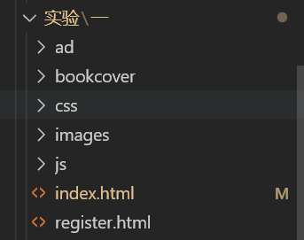

# 实验一：web客户端技术

## 一.实验目的

1. 掌握Dreamweaver、Code等工具的使用
2. 熟悉HTML的常用标记
3. 熟悉CSS选择器和常用属性
4. 掌握HTML+CSS+JavaScript的开发基础

## 二． 实验类型：验证型

---

## 三． 实验学时：12学时

---

## 四． 实验原理及知识点

---

1. HTML的常用标记包括文字与段落，建立列表，图片及多媒体文件的使用，建立超链接，建立表单页面
2. 页面的布局
3. 样式语法，样式属性，样式类
4. 脚本语言语法，HTML DOM模型，事件响应模型。

## 五．实验环境（硬件环境、软件环境）

---

1. 硬件环境：微型电子计算机Intel Pentium 4 CPU 1.2GHz，512MB RAM及以上
2. 软件环境:
   操作系统：Windows 7 以上
   Web服务器：Tomcat 8 以上
   数据库：MySQL 5 以上
   软件工具：Eclipse 4 集成开发工具/IDEA、Chrome浏览器

## 六．实验内容及步骤

---

### **1. 书城首页的实现**

#### **功能**

+ 布局（第一次上机课）
+ 水平菜单栏（第2次上机课）
+ 下拉菜单（第2次上机课）
+ 表格变色（第3次上机课）
+ 广告页轮播（第4次上机课）

#### **效果图**


#### 不使用css的效果图：


### **实验步骤**

**1）.创建资源文件夹
**2).布局****

* 写出HTML的分层各部分
* 为每个层布局，定义背景色和大小、定位（宽度、高度、框模型），局部通过table来设置位置
* divhead 头部区域通过table布局，创建一行两列的表格。

```html
  <!--网页上方的项目-->
<div id = divhead>
    <table cellspacing = "0" class = "headtable"> 
        <tr>
            <td>
                <a href="#">
                    
                </a>
            </td>
            <td style="text-align:right"><!--靠右对齐-->
                 <a href="#">购物车</a>
                <a href="#">帮助中心</a> 
                <a href="#">我的账户</a>
                <a href="register.html"><!--切换注册页面-->注册账户</a>
            </td>
        </tr>
    </table>
</div>
    <!--书店的上方项目结束-->
```

* divmenu菜单项布局

```css
    #divmenu {
	width: 100%;
	border-top-width: 4px;
	border-top-style: solid;
	border-top-color: #b4d76d;
	background-color: #000000;
	text-align: center;
	padding: 10px 0px 10px 0px;
	font-size: 14px;
}
```

* divsearch 一个输入框和一个查找按钮

```html
    <!--搜索书籍-->
<div id="divsearch">
    <form action="#" id="searchform">
        <table width="100%" border="0" cellspacing="0"><!--width为范围-->
            <tr>
                <td style="text-align:right; padding-right:200px">
                    <!--样式中 右内边距定位-->
                    <input type="text" name="textfield" class="inputtable" id="textfield" value="请输入要查找的书名"
                    onmouseover="this.focus();"
                    onclick="my_click(this, 'textfield');"
                    onblur="my_blur(this, 'textfield');" />
                    <a href ="#">
                        
                    </a>
                </td>
            </tr>
        </table>
    </form>
</div>
```


* box_autoplay轮播图 固定宽度和高度，左下角排列按钮

```css
box_autoplay {
    position: relative;
    width: 900px;
    height: 335px;
    background: #fff;
    border-radius: 5px;
    border:8px solid #fff;
	margin:10px auto;
	cursor:pointer;   
}

#box_autoplay .list {
    position: relative;
    width: 900px;
    height: 335px;
    overflow: hidden;
}

#box_autoplay .list ul {
    position: absolute; 
    top: 0;  
    left:0; 
}

#box_autoplay .list li { 
    width:900px; 
    height:335px; 
    overflow:hidden; 
}

#box_autoplay .count li {
	color:#fff;
	float:left;
	width:20px;
	height:20px;
	cursor:pointer;
	margin-right:5px;
	overflow:hidden;
	background:#F90;
	opacity:0.7;
	filter:alpha(opacity=70);
	border-radius:20px;
}

#box_autoplay .count li.current {
	color:#fff;
	opacity:1;
	filter:alpha(opacity=100);
	font-weight:700;
	background:#f60;
}

#tmp {
	width:100px;
	height:100px;
	background:red;
	position:absolute;
}
```

```

```

* divcontent  左边使用文本框，右边插入图片

```css
#divcontent {
    width: 900px;
    background-color: #FCFDEF;
    border: 1px solid #EEEDDB;
    MARGIN-RIGHT: auto;
    MARGIN-LEFT: auto;
    height: 250px;
}
```

* divfoot 底部一张图片和文本

```html
<!--5. 网上书城底部 start -->
<div id="divfoot">
    <table width="100%" border="0" cellspacing="0" >
        <tr>
            <td rowspan="2" style="width:10%">
                
            </td>
            <td style="padding-top:5px; padding-left:50px">
                <a href="#">
                    <font color="#747556"><b>CONTACT US</b></font> 
                </a>
            </td>
        </tr>
        <tr>
            <td style="padding-left:50px">
                <font color="#CCCCCC">
                    <b>COPYRIGHT 2015 © BookStore All Rights RESERVED.</b> 
                </font>
            </td>
        </tr>
    </table>
</div>

<!-- 网上书城底部  end -->

#divfoot {
    width: 100%;
    clear: both;
    background-color: #efefef;
    margin-top: 15px;
}
```

**3).菜单的实现**

```html
    <!--书店菜单-->
<div id="divmenu">
        <a href="#">文学</a>
        <a href="#">数学</a>
        <a href="#">语言</a>
        <a href="#">科学</a>
        <a href="#">悬疑</a>
        <a href="#">科幻</a>
        <a href="#">儿童</a>
        <a href="#">生活</a>
        <a href="#" style="color: red">全部商品目录</a>
    </tr>
</div> 
    <!--书店菜单结束-->
```

* 实现效果图：

**4).下拉菜单**

* 代码如下:

```html
<html>
<head>
    <title>下拉菜单实例</title>
    <script language="JavaScript">
        function show(menu) {
            document.getElementById(menu).style.visibility = "visible";
        }
        function hide() {
            document.getElementById("menu1").style.visibility =
                "hidden";
            document.getElementById("menu2").style.visibility =
                "hidden";
            document.getElementById("menu3").style.visibility = "hidden";
        }
    </script>
</head>
<body>
    <table>
        <tr bgcolor="#9999ff" align="center">
            <td width="120" onmousemove="show('menu1')" onmouseout="hide()">系列课程</td>
            <td width="120" onmousemove="show('menu2')" onmouseout="hide()">教学课件</td>
            <td width="120" onmousemove="show('menu3')" onmouseout="hide()">课程大纲</td>
        </tr>
    </table>
    <div id="menu1" onmousemove="show('menu1')" onmouseout="hide()"
        style="background: #9999ff;position:absolute;left:12px;top:38;width:120;visibility: hidden">
        <span>C++程序设计</span><br />
        <span>Java程序设计</span><br />
        <span>Python程序设计</span><br />
    </div>
    <div id="menu2" onmousemove="show('menu2')" onmouseout="hide()"
        style="background: #9999ff;position:absolute;left:137px;top:38;width:120;visibility: hidden">
        <span>C++课件</span><br />
        <span>Java课件</span><br />
        <span>Python课件</span><br />
    </div>
    <div id="menu3" onmousemove="show('menu3')" onmouseout="hide()"
        style="background: #9999ff;position:absolute;left:260px;top:38;width:120;visibility: hidden">
        <span>C++大纲</span><br />
        <span>Java大纲</span><br />
        <span>Python大纲</span><br />
    </div>
</body>
</html>
```

* 效果图:.png)
  **5).轮播图**
* 代码如下:

```html
    <!--推荐书籍轮播画面-->
<div id="box_autoplay">
    <div class="list">
        <ul>
            <li></li>
            <li></li>
            <li></li>
            <li></li>
            <li></li>
        </ul>
    </div>
</div>
```

* 在js中完成的部分:

```js
//获取ID
var $ = function (id) {return typeof id === "string" ? document.getElementById(id) : id;};
//获取tagName
var $$ = function (tagName, oParent) {return (oParent || document).getElementsByTagName(tagName);};
//自动播放对象
var AutoPlay = function (id) {this.initialize(id);};
AutoPlay.prototype = {
	initialize: function (id)
	{
		var oThis = this;
		this.oBox = $(id);
		this.oUl = $$("ul", this.oBox)[0];
		this.aImg = $$("img", this.oBox);
		this.timer = null;
		this.autoTimer = null;
		this.iNow = 0;
		this.creatBtn();
		this.aBtn = $$("li", this.oCount);
		this.toggle();
		this.autoTimer = setInterval(function ()
		{
			oThis.next();
		}, 3000);
		this.oBox.onmouseover = function ()
		{
			clearInterval(oThis.autoTimer);
		};
		this.oBox.onmouseout = function ()
		{
			oThis.autoTimer = setInterval(function ()
			{
				oThis.next();
			}, 3000);
		};
		for (var i = 0; i < this.aBtn.length; i++)
		{
			this.aBtn[i].index = i;
			this.aBtn[i].onmouseover = function ()
			{
				oThis.iNow = this.index;
				oThis.toggle();
			};
		}
	},
	creatBtn: function ()
	{
		this.oCount = document.createElement("ul");
		this.oFrag = document.createDocumentFragment();
		this.oCount.className = "count";
		for (var i = 0; i < this.aImg.length; i++)
		{
			var oLi = document.createElement("li");
			oLi.innerHTML = i + 1;
			this.oFrag.appendChild(oLi);
		}
		this.oCount.appendChild(this.oFrag);
		this.oBox.appendChild(this.oCount);
	},
	toggle: function ()
	{
		for (var i = 0; i < this.aBtn.length; i++) this.aBtn[i].className = "";
		this.aBtn[this.iNow].className = "current";
		this.doMove(-(this.iNow * this.aImg[0].offsetHeight));
	},
	next: function ()
	{
		this.iNow++;
		this.iNow == this.aBtn.length && (this.iNow = 0);
		this.toggle();
	},
	doMove: function (iTarget)
	{
		var oThis = this;
		clearInterval(oThis.timer);
		oThis.timer = setInterval(function ()
		{
			var iSpeed = (iTarget - oThis.oUl.offsetTop) / 5;
			iSpeed = iSpeed > 0 ? Math.ceil(iSpeed) : Math.floor(iSpeed);
			oThis.oUl.offsetTop == iTarget ? clearInterval(oThis.timer) : (oThis.oUl.style.top = oThis.oUl.offsetTop + iSpeed + "px");
		}, 30);
	}
};
window.onload = function ()
{
	new AutoPlay("box_autoplay");
};
```

**6).表格变色**

* 代码如下:

```html
  <html>
    <head>
        <title>变色表格实例</title>
        <script language="JavaScript">
            function change(row){
                document.getElementById(row).style.backgroundColor='#ccccff';
            }
            function reset(row){
                document.getElementById(row).style.backgroundColor='';
            }
        </script>
    </head>
    <body>
        <table width='200px' border="1" cellpadding="1" align="=center">
            <tr><th><学习/th><th>专业</th><th>人数</th></tr>
            <tr align="center" id="row1" onmouseover="change('row1')" 
            onmouseout="reset('row1')"><td>北大</td><td>数学</td><td>2000</td></tr>
            <tr align="center" id="row2" onmouseover="change('row2')" 
            onmouseout="reset('row2')"><td>清华</td><td>计算机</td><td>5000</td></tr>
            <tr align="center" id="row3" onmouseover="change('row3')" 
            onmouseout="reset('row3')"><td>北邮</td><td>电子工程</td><td>2400</td></tr>
            <tr align="center" id="row4" onmouseover="change('row4')" 
            onmouseout="reset('row4')"><td>复旦</td><td>新闻</td><td>3000</td></tr>

        </table>
    </body>
</html>
```

* 效果图:

  
* # 实验二：注册页面的实现

  ## 一.实验目的


  1. 掌握Dreamweaver、Code等工具的使用
  2. 熟悉HTML的常用标记
  3. 熟悉CSS选择器和常用属性
  4. 掌握HTML+CSS+JavaScript的开发基础

  ## 二． 实验类型：验证型

  ---

  ## 三． 实验学时：12学时

  ---

  ## 四． 实验原理及知识点

  ---

  1. 设计一个用户注册的页面
  2. 实现表单校验功能
  3. 采用Bootstrap框架实现注册页面

  ## 五．实验环境（硬件环境、软件环境）

  ---

  1. 硬件环境：微型电子计算机Intel Pentium 4 CPU 1.2GHz，512MB RAM及以上
  2. 软件环境:
     操作系统：Windows 7 以上
     Web服务器：Tomcat 8 以上
     数据库：MySQL 5 以上
     软件工具：Eclipse 4 集成开发工具/IDEA、Chrome浏览器

  ## 六．实验内容及步骤

  ### 创建register.html注册页面

  代码：

  ```html
  <div id="divcontent" align="center">
  		<form action="registersuccess.html" method="post" onsubmit="return checkForm();">
  			<table width="850px" border="0" cellspacing="0">
  				<tr>
  					<td style="padding: 30px"><h1>新会员注册</h1>
  						<table width="70%" border="0" cellspacing="2" class="upline">
  							<tr>
  								<td style="text-align: right; width: 20%">会员邮箱：</td>
  								<td style="width: 40%">
  								<input type="text" class="textinput"  id="email" name="email" onkeyup="checkEmail();"/>
  								</td>
  								<td colspan="2"><span id="emailMsg"></span><font color="#999999">请输入有效的邮箱地址</font></td>
  							</tr>
  							<tr>
  								<td style="text-align: right">会员名：</td>
  								<td><input type="text" class="textinput"  id="username" name="username" onkeyup="checkUsername();"/>
  								</td>
  								<td colspan="2"><span id="usernameMsg"></span><font color="#999999">字母数字下划线1到10位, 不能是数字开头</font></td>
  							</tr>
  							<tr>
  								<td style="text-align: right">密码：</td>
  								<td><input type="password" class="textinput"  id="password" name="password" onkeyup="checkPassword();"/></td>
  								<td><span id="passwordMsg"></span><font color="#999999">密码请设置6-16位字符</font></td>
  							</tr>
  							<tr>
  								<td style="text-align: right">重复密码：</td>
  								<td>
  								<input type="password" class="textinput"  id="repassword" name="repassword" onkeyup="checkConfirm();"/>
  								</td>
  								<td><span id="confirmMsg"></span> </td>
  							</tr>
  							<tr>
  								<td style="text-align: right">性别：</td>
  								<td colspan="2">  
                                  <input type="radio" name="gender" value="男" checked="checked" /> 男
  									       
  									<input type="radio" name="gender" value="女" /> 女
  								</td>
  								<td> </td>
  							</tr>
  							<tr>
  								<td style="text-align: right">联系电话：</td>
  								<td colspan="2">
  								<input type="text" class="textinput"
  									style="width: 350px" name="telephone" />
  								</td>
  								<td> </td>
  							</tr>
  							<tr>
  								<td style="text-align: right">个人介绍：</td>
  								<td colspan="2">
  								<textarea class="textarea" name="introduce"></textarea>
  								</td>
  								<td> </td>
  							</tr>
  						</table>

  						<table width="70%" border="0" cellspacing="0">
  							<tr>
  								<td style="padding-top: 20px; text-align: center">
  									<input type="image" src="images/signup.gif" name="submit" border="0"/>
  								</td>
  							</tr>
  						</table>
  					</td>
  				</tr>
  			</table>
  		</form>
  	</div>
  ```

  ### 创建form.js文件，实现表单校验功能

  ```js
  var emailObj;
  var usernameObj;
  var passwordObj;
  var confirmObj;

  var emailMsg;
  var usernameMsg;
  var passwordMsg;
  var confirmMsg;

  window.onload = function() {	// 页面加载之后, 获取页面中的对象
  	emailObj = document.getElementById("email");
  	usernameObj = document.getElementById("username");
  	passwordObj = document.getElementById("password");
  	confirmObj = document.getElementById("repassword");

  	emailMsg = document.getElementById("emailMsg");
  	usernameMsg = document.getElementById("usernameMsg");
  	passwordMsg = document.getElementById("passwordMsg");
  	confirmMsg = document.getElementById("confirmMsg");
  };

  function checkForm() {			// 验证整个表单
  	var bEmail = checkEmail();
  	var bUsername = checkUsername();
  	var bPassword = checkPassword();
  	var bConfirm = checkConfirm();
  	return bUsername && bPassword && bConfirm && bEmail ;	// return false后, 事件将被取消
  }

  function checkEmail() {			// 验证邮箱
  	var regex = /^[\w-]+@([\w-]+\.)+[a-zA-Z]{2,4}$/;
  	var value =emailObj.value;
  	var msg = "";
  	if (!value)
  		msg = "邮箱必须填写：";
  	else if (!regex.test(value))
  		msg = "邮箱格式不合法：";
  	emailMsg.innerHTML = msg;
  	emailObj.parentNode.parentNode.style.color = msg == "" ? "black" : "red";
  	return msg == "";
  }

  function checkUsername() {		// 验证用户名
  	var regex = /^[a-zA-Z_]\w{0,9}$/;	// 字母数字下划线1到10位, 不能是数字开头
  	var value = usernameObj.value;// 获取usernameObj中的文本
  	var msg = "";						// 最后的提示消息, 默认为空
  	if (!value)							// 如果用户名没填, 填了就是一个字符串可以当作true, 没填的话不论null或者""都是false
  		msg = "用户名必须填写：";			// 改变提示消息
  	else if (!regex.test(value))		// 如果用户名不能匹配正则表达式规则
  		msg = "用户名不合法：";			// 改变提示消息
  	usernameMsg.innerHTML = msg;		// 将提示消息放入SPAN
  	usernameObj.parentNode.parentNode.style.color = msg == "" ? "black" : "red";	// 根据消息结果改变tr的颜色
  	return msg == "";					// 如果提示消息为空则代表没出错, 返回true
  }

  function checkPassword() {		// 验证密码
  	var regex = /^.{6,16}$/;			// 任意字符, 6到16位
  	var value = passwordObj.value;
  	var msg = "";
  	if (!value)
  		msg = "密码必须填写：";
  	else if (!regex.test(value))
  		msg = "密码不合法：";
  	passwordMsg.innerHTML = msg;
  	passwordObj.parentNode.parentNode.style.color = msg == "" ? "black" : "red";
  	return msg == "";
  }

  function checkConfirm() {		// 验证确认密码
  	var passwordValue = passwordObj.value;
  	var confirmValue = confirmObj.value;
  	var msg = "";

      if(!confirmValue){
  	    msg = "确认密码必须填写";
  	}
  	else	if (passwordValue != confirmValue){
  		msg = "密码必须保持一致";
      }
  	confirmMsg.innerHTML = msg;
  	confirmObj.parentNode.parentNode.style.color = msg == "" ? "black" : "red";
  	return msg == "";
  }
  ```

  ## 实现图

  

# 实验三：Web服务器端技术

#### 一．实验目的

1. **掌握在IDEA中配置Tomcat服务器的方法**
2. **掌握Servlet的工作原理及运行和配置方法**
3. **掌握Servlet获取请求参数的方法、Servlet实现转发请求的方法**
4. **熟悉使用Session对象实现购物车和用户登录功能**
5. **熟悉JSP指令和隐式对象的使用**
6. **熟悉JSTL中常用的Core标签库**
7. **掌握使用Filter实现用户自动登录和实现统一全站编码以及监听器监听域对象的生命周期的属性变**
   **更**
8. **掌握JDBC操作数据库的步骤**
9. **熟悉通过数据源获取数据库连接的方法**
10. **熟悉使用JSP Model2的思想开发程序**

#### 二．实验类型：验证型

#### 三．实验学时：20学时

#### 四．实验原理及知识点

1. **Servlet的生命周期方法**
2. **请求和响应对象的含义和应用、Servlet获取请求参数的方法、Servlet实现转发请求的方法**
3. **Cookie对象和Session对象的使用**
4. **JSP的基本语法**
5. **JavaBean、EL表达式和JSTL标签库**
6. **Filter过滤器、Listener监听器**
7. **JDBC的常用API**
8. **数据库连接池**
9. **MVC设计模式**
10. **10.Ajax**

#### 五．实验环境（硬件环境、软件环境）

1. **硬件环境：微型电子计算机Intel Pentium 4 CPU 1.2GHz，512MB RAM及以上**
2. **软件环境：**
   **操作系统：Windows 7 以上**
   **Web服务器：Tomcat 8 以上**
   **数据库：MySQL 5 以上**
   **软件工具：Eclipse 4 集成开发工具/IDEA、Chrome浏览器**
   **六．实验内容及步骤**
   **1.了解Maven**
3. **Servlet的用法：使用IDEA新建Maven Web工程，新建一个**
   **Servlet，在客户端输出 Hello World，跟踪生命周期三个阶段，理解注解工作原理。**

#### 六.输出Hello Word

```java
package com.example.demo2;

import java.io.*;
import javax.servlet.http.*;
import javax.servlet.annotation.*;

@WebServlet(name = "helloServlet", value = "/hello-servlet")
public class HelloServlet extends HttpServlet {
    private String message;

    public void init() {
        message = "Hello World!";
    }

    public void doGet(HttpServletRequest request, HttpServletResponse response) throws IOException {
        response.setContentType("text/html");

        // Hello
        PrintWriter out = response.getWriter();
        out.println("<html><body>");
        out.println("<h1>" + message + "</h1>");
        out.println("</body></html>");
    }

    public void destroy() {
    }
}
```

* **实现效果图：**

  

#### 七.跟踪生命周期三阶段

```
import java.io.*;
import javax.servlet.http.*;
import javax.servlet.annotation.*;

@WebServlet(name = "helloServlet", value = "/hello-servlet")
public class HelloServlet extends HttpServlet {
    private String message;

    public void init() {
        message = "Hello World!";
    }

    public void doGet(HttpServletRequest request, HttpServletResponse response) throws IOException {
        response.setContentType("text/html");

        // Hello
        PrintWriter out = response.getWriter();
        out.println("<html><body>");
        out.println("<h1>" + message + "</h1>");
        out.println("</body></html>");
    }

    public void destroy() {
    }
}
```

#### 八.解决中文乱码问题

### 1.html页面

```
在页面的<head>标签内添加<meta>标签
<meta http-equiv="Content-Type" content="text/htmlcharset=UTF-8">
或者
<meta charset="utf-8">
```

### 2.jsp页面

```
在jsp页面的顶部加上以下代码
<%@ page language="java" contentType="text/html; charset=UTF-8" pageEncoding="UTF-8"%>
同时在<head>标签下添加<meta>标签
<meta http-equiv="Content-Type" content="text/html; charset=UTF-8">
```

**package com.example.home4;**

**import java.io.***;**
**import javax.servlet.http.*;**
**import javax.servlet.annotation.*;

**@WebServlet(name = "helloServlet", value = "/hello-servlet")**
**public class HelloServlet extends HttpServlet {**
**    private String message;**

```
public void init() {
    message = "你好!";
}

public void doGet(HttpServletRequest request, HttpServletResponse response) throws IOException {
    response.setContentType("text/html");

    // Hello
    PrintWriter out = response.getWriter();
    out.println("<html><body>");
    out.println("<h1>" + message + "</h1>");
    out.println("</body></html>");
}

public void destroy() {
}
```

**}**
**乱码效果图：**


**解决乱码之后效果图：**


#### 九.总结

**通过这次实验学会了使用idea，并且将tomcat添加到idea中，可以在客户端中输出想输出的东西。并且理解了生命周期。**
**如果出现了乱码的情况，也不要着急，先冷静分析，乱码是出现在哪一个环节，然后通过对应的方法解决**

## 实验三

### 一.请求重定向

#### login.html:

```
<!DOCTYPE html PUBLIC "-//W3C//DTD HTML 4.01 Transitional//EN"
        "http://www.w3.org/TR/html4/loose.dtd">
<html>
<head>
    <meta http-equiv="Content-Type" content="text/html; charset=UTF-8">
    <title>Insert title here</title>
</head>
<body>
<!--把表单内容提交到chapter04中的LoginServlet-->
<form action="/home4_war_exploded/LoginServlet" method="post">
    用户名:<input type="text" name="username" /><br />
    密   码:<input type="password" name="password" /><br />
    <input type="submit" value="登录">
</form>
</body>
</html>
```

#### welcome.html

```
<!DOCTYPE html PUBLIC "-//W3C//DTD HTML 4.01 Transitional//EN"
        "http://www.w3.org/TR/html4/loose.dtd">
<html>
<head>
    <meta http-equiv="Content-Type" content="text/html; charset=UTF-8">
    <title>Insert title here</title>
</head>
<body>
欢迎你，登录成功!
</body>
</html>
```

#### LoginServlet:

```
package com.example.home4;

import javax.servlet.ServletException;
import javax.servlet.annotation.WebServlet;
import javax.servlet.http.HttpServlet;
import javax.servlet.http.HttpServletRequest;
import javax.servlet.http.HttpServletResponse;
import java.io.IOException;

@WebServlet(name = "LoginServlet", urlPatterns = "/LoginServlet")
public class LoginServlet extends HttpServlet {
    public void doGet(HttpServletRequest request, HttpServletResponse response)
            throws ServletException, IOException{
        response.setContentType("text/html;charset=utf-8");
        //
        String username = request.getParameter("username");
        String password = request.getParameter("password");
        //
        if(("abc").equals(username) &&("123").equals(password)){
            //
            response.sendRedirect("/home4_war_exploded/welcome.html");
        }
        else{
            response.sendRedirect("/home4_war_exploded/login.html");
        }
    }
    public void doPost(HttpServletRequest request, HttpServletResponse response)
            throws ServletException, IOException {
        doGet(request,response);
    }
}
```

**用户名和密码输入正确后跳转welcome.html页面：**


**输入错误回到登录界面login.html:**


### 二.RequestDispatcher实现请求转发，并利用request传递数据

#### RequestForwardServlet:

```
package com.example.home4;


import javax.servlet.RequestDispatcher;
import javax.servlet.ServletException;
import javax.servlet.annotation.WebServlet;
import javax.servlet.http.HttpServlet;
import javax.servlet.http.HttpServletRequest;
import javax.servlet.http.HttpServletResponse;
import java.io.IOException;

@WebServlet(name = "RequestForwardServlet",urlPatterns = "/RequestForwardServlet")
public class RequestForwardServlet extends HttpServlet {
    public void doGet(HttpServletRequest request, HttpServletResponse response)
            throws ServletException,IOException{
        response.setContentType("text/html;charset=utf-8");
        request.setAttribute("username","张三");
        RequestDispatcher dispatcher = request.getRequestDispatcher("/ResultServlet");
        dispatcher.forward(request,response);
    }
    public void doPost(HttpServletRequest request, HttpServletResponse response)
            throws ServletException,IOException {
        doGet(request,response);
    }
}
```

#### ResultServlet:

```
package com.example.home4;

import javax.servlet.ServletException;
import javax.servlet.annotation.WebServlet;
import javax.servlet.http.HttpServlet;
import javax.servlet.http.HttpServletRequest;
import javax.servlet.http.HttpServletResponse;
import java.io.IOException;
import java.io.PrintWriter;

@WebServlet(name = "ResultServlet",urlPatterns = "/ResultServlet")
public class ResultServlet extends HttpServlet {
    public void doGet(HttpServletRequest request, HttpServletResponse response)
            throws ServletException, IOException {
        response.setContentType("text/html;charset=utf-8");
        PrintWriter out = response.getWriter();
        String username = (String)request.getAttribute("username");
        if(username!=null){
            out.println("用户名:"+username+"<br/>");
        }
    }
    public void doPost(HttpServletRequest request, HttpServletResponse response)
            throws ServletException,IOException {
        doGet(request,response);
    }
}
```

**运行效果图:**


### 三.获取请求参数:

#### RequestParamsServlet：

```
package com.example.home4;

import javax.servlet.ServletException;
import javax.servlet.annotation.WebServlet;
import javax.servlet.http.HttpServlet;
import javax.servlet.http.HttpServletRequest;
import javax.servlet.http.HttpServletResponse;
import java.io.IOException;

@WebServlet(name = "RequestParamsServlet",urlPatterns = "/RequestParamsServlet")
public class RequestParamsServlet extends HttpServlet {
    public void doGet(HttpServletRequest request, HttpServletResponse response)
            throws ServletException, IOException {
        request.setCharacterEncoding("utf-8");
        String name = request.getParameter("username");
        String password = request.getParameter("password");

        System.out.println("用户名:" + name);
        System.out.println("密 码:" + password);

        String[] hobbys = request.getParameterValues("hobby");
        System.out.println("爱好:");
        for (int i = 0; i < hobbys.length; i++) {
            System.out.println(hobbys[i] + ",");
        }
    }
    public void doPost(HttpServletRequest request, HttpServletResponse response)
            throws ServletException,IOException {
        doGet(request,response);
    }

}
```

#### form.html:

```
<!DOCTYPE html PUBLIC "-//W3C//DTD HTML 4.01 Transitional//EN"
        "http://www.w3.org/TR/html4/loose.dtd">
<html>
<head>
    <meta http-equiv="Content-Type" content="text/html; charset=UTF-8">
    <title>Insert title here</title>
</head>
<body>
<form action="/home4_war_exploded/RequestParamsServlet" method="post">
    用户名:<input type="text" name="username" /><br />
    密   码:<input type="password" name="password" /><br />
    爱好:
    <input type="checkbox" name="hobby" value="sing">唱歌
    <input type="checkbox" name="hobby" value="dance">跳舞
    <input type="checkbox" name="hobby" value="football">足球<br />
    <input type="submit" value="提交">
</form>
</body>
</html>
```

**运行效果图：**


## 总结

**学习到了许多知识，在这次实验知道了如何实现servlet之间的相互跳转，获取请求参数**

#### 5.Cookie的用法：显示用户上次访问时间（第9次上机课）

```
package Cookie;

import javax.servlet.ServletException;
import javax.servlet.annotation.WebServlet;
import javax.servlet.http.Cookie;
import javax.servlet.http.HttpServlet;
import javax.servlet.http.HttpServletRequest;
import javax.servlet.http.HttpServletResponse;
import java.io.IOException;
import java.net.URLDecoder;
import java.net.URLEncoder;
import java.text.SimpleDateFormat;
import java.util.Date;

@WebServlet(name = "CookieServlet", value = "/cookie")
public class CookieServlet extends HttpServlet {

    private SimpleDateFormat sdf = new SimpleDateFormat("yyyy年MM月dd日 HH:mm:ss");

    @Override
    protected void doGet(HttpServletRequest request, HttpServletResponse response) throws ServletException, IOException {
        doPost(request, response);
    }

    @Override
    protected void doPost(HttpServletRequest request, HttpServletResponse response) throws ServletException, IOException {
        request.setCharacterEncoding("utf-8");
        response.setContentType("text/html;charset=utf-8");
        //获取cookie
        Cookie[] cookies = request.getCookies();
        boolean flag = false;
        for (Cookie cookie : cookies) {
            //判断我们存的cookie名和得到的Cookie名是否一致
            if ("szc".equals(cookie.getName())) {
                //表示cookie不是第一次访问
                flag = true;
                Date date = new Date();
                String format = sdf.format(date);
                format = URLEncoder.encode(format, "utf-8");
                cookie.setValue(format);
                //将cookie添加到response对象中
                response.addCookie(cookie);
                String value = cookie.getValue();
                value = URLDecoder.decode(value, "utf-8");
                response.getWriter().write("<h1>欢迎回来" + cookie.getName() + ",上次访问的时间为" + value + "</h1>");
                break;
            }
        }

        if (flag == false) {
            Date date = new Date();
            String format = sdf.format(date);
            format = URLEncoder.encode(format, "utf-8");
            //第一次则创建cookie
            Cookie cookie = new Cookie("szc", format);
            //将cookie添加到response对象中
            response.addCookie(cookie);
            response.getWriter().write("<h1>欢迎," + cookie.getName() + "这是您第一次访问</h1>");
        }
    }
}

```

#### 6.Session的用法：Session实现用户登录、实现购物车（第10次上机课）

**login.html**

```
<!DOCTYPE html>
<html lang="en">
<head>
    <meta charset="UTF-8">
    <title>Title</title>
</head>
<body>
<form name="reg" action="http://localhost:8080/ServerletDemo1/LoginServlet"
      method="post">
    用户名: <input name="username" type="text"/><br/>
    密码：  <input name="password" type="password"/><br/>
    <input type="submit" value="提交" id="bt"/>
</form>
</body>
</html>
```

**User.java**

```
public class User {
    private String username;
    private String password;
    public String getUsername() {return username;}
    public void setUsername(String username) {this.username = username;}
    public String getPassword() {return password;}
    public void setPassword(String password) {this.password = password;}
}
```

**indexServelet.java**

```
package Session;

import javax.servlet.ServletException;
import javax.servlet.annotation.WebServlet;
import javax.servlet.http.*;
import java.io.IOException;

@WebServlet("/index")
public class IndexServlet extends HttpServlet {
    public void doGet(HttpServletRequest request, HttpServletResponse response)
            throws ServletException, IOException {
        // 解决乱码问题
        response.setContentType("text/html;charset=utf-8");
        // 创建或者获取保存用户信息的Session对象
        HttpSession session = request.getSession();
        User user = (User) session.getAttribute("user");
        if (user == null) {
            response.getWriter().print(
                    "您还没有登录，请<a href='/ServerletDemo1_war/login.html'>登录</a>");
        } else {response.getWriter().print("您已登录，欢迎你，" + user.getUsername() + "！");
            response.getWriter().print("<a href='/ServerletDemo1_war/user.jsp'>进入</a>");
            // 创建Cookie存放Session的标识号
            Cookie cookie = new Cookie("cookie", session.getId());
            cookie.setMaxAge(60 * 30);
            cookie.setPath("/ServerletDemo1");
            response.addCookie(cookie);
        }
    }
    public void doPost(HttpServletRequest request,
                       HttpServletResponse response)
            throws ServletException, IOException {
        doGet(request, response);
    }
}

```


**LoginServlet.java**

```
package Session;

import javax.servlet.ServletException;
import javax.servlet.http.HttpServlet;
import javax.servlet.http.HttpServletRequest;
import javax.servlet.http.HttpServletResponse;
import java.io.IOException;
import java.io.PrintWriter;

public class LoginServlet extends HttpServlet {
    public void doGet(HttpServletRequest request,
                      HttpServletResponse response)
            throws ServletException, IOException {
        response.setContentType("text/html;charset=utf-8");
        String username = request.getParameter("username");
        String password = request.getParameter("password");
        PrintWriter pw = response.getWriter();
        //假设正确的用户名 是itcast 密码是123
        if (("itcast").equals(username) && ("123").equals(password)) {
            User user = new User();
            user.setUsername(username);
            user.setPassword(password);
            request.getSession().setAttribute("user", user);
            response.sendRedirect("/ServerletDemo1/IndexServlet");
        } else {
            pw.write("用户名或密码错误，登录失败");
        }
    }
    public void doPost(HttpServletRequest request,
                       HttpServletResponse response)
            throws ServletException, IOException {
        doGet(request, response);
    }
}

```

#### 7.JSP的用法：用JSP技术转发到登录页面，重写书城首页、注册页面（第11次上机课）

**login.jsp**

```
<%@ page contentType="text/html;charset=UTF-8" language="java" %>
<html>
<head>
    <title>用户登录</title>
</head>
<body>
<form name="form1" method="post" action="">
    用户名：  <input name="name" type="text" id="name" style="width:
  200px"><br><br>
    密   码：  <input name="pwd" type="password" id="pwd"
                                  style="width: 200px"><br><br>
    <input type="submit" name="Submit" value="提交">
</form>
</body>
</html>
```

**header.jsp**

```
<%--
  Created by IntelliJ IDEA.
  User: szc
  Date: 2022/10/29
  Time: 21:13
  To change this template use File | Settings | File Templates.
--%>
<%@ page contentType="text/html;charset=UTF-8" language="java" %>
<head>
    <meta http-equiv="Content-Type" content="text/html; charset=UTF-8">
    <title>首页</title>
    <link type="text/css" href="css/main.css" rel="stylesheet"  />
    <!-- 导入首页轮播图css和js脚本 -->
    <link type="text/css" href="css/autoplay.css" rel="stylesheet" />
    <script type="text/javascript" src="js/autoplay.js"></script>
</head>
<body class="main">
<!-- 1.网上书城顶部 start -->
<div id="divhead">
    <table cellspacing="0" class="headtable">
        <tr>
            <td>
                <a href="#">
                    </a>
            </td>
            <td style="text-align:right">
                 
                <a href="#">购物车</a>
                | <a href="#">帮助中心</a>
                | <a href="#">我的帐户</a>
                | <a href="user.jsp">新用户注册</a>
            </td>
        </tr>
    </table>

</div>
<!-- 网上书城顶部  end -->

<!--2. 网上书城菜单列表 start -->
<div id="divmenu">
    <a href="#">文学</a>
    <a href="#">生活</a>
    <a href="#">计算机</a>
    <a href="#">外语</a>
    <a href="#">经管</a>
    <a href="#">励志</a>
    <a href="#">社科</a>
    <a href="#">学术</a>
    <a href="#">少儿</a>
    <a href="#">艺术</a>
    <a href="#">原版</a>
    <a href="#">科技</a>
    <a href="#">考试</a>
    <a href="#">生活百科</a>
    <a href="#" style="color:#2bd856">全部商品目录</a>
</div>
<div id="divsearch">
    <form action="#" id="searchform">
        <table width="110%" border="0" cellspacing="0">
            <tr>
                <td style="text-align:right; padding-right:220px">
                    Search<input type="text" name="textfield" class="inputtable" id="textfield" value="请输入书名"
                                 onmouseover="this.focus();"
                                 onclick="my_click(this, 'textfield');"
                                 onBlur="my_blur(this, 'textfield');"/>
                    <a href="#">
                        
                    </a>
                </td>
            </tr>
        </table>
    </form>
</div>
```

**forward.jsp**

```
<%@ page contentType="text/html;charset=UTF-8" language="java" %>
<html>
<head>
    <title>中转页</title>
</head>
<body>
<jsp:forward page="login.jsp"/>
</body>
</html>


```

**user.jsp**

```
<%@ page contentType="text/html;charset=UTF-8" language="java" %>
<!DOCTYPE html>
<html>
<head>
    <title>用户注册</title>
    <meta name="viewport" content="width=device-width, initial-scale=1">
    <meta http-equiv="Content-Type" content="text/html; charset=utf-8">
    <link type="text/css" rel="stylesheet" href="css/bootstrap.css">
    <link type="text/css" rel="stylesheet" href="css/style.css">
</head>
<body>
<!--header-->
<jsp:include page="/header.jsp"/>
<!--//header-->
<!--account-->
<div class="account">
    <div class="container">
        <div class="register">
            <form action="/user_rigister" method="post">
                <div class="register-top-grid">
                    <h3>注册新用户</h3>
                    <div class="input">
                        <span>用户名 <label style="color:red;">*</label></span>
                        <input type="text" name="username" placeholder="请输入用户名" required="required">
                    </div>
                    <div class="input">
                        <span>邮箱 <label style="color:red;">*</label></span>
                        <input type="text" name="email" placeholder="请输入邮箱" required="required">
                    </div>
                    <div class="input">
                        <span>密码 <label style="color:red;">*</label></span>
                        <input type="password" name="password" placeholder="请输入密码" required="required">
                    </div>
                    <div class="input">
                        <span>收货人<label></label></span>
                        <input type="text" name="name" placeholder="请输入收货人">
                    </div>
                    <div class="input">
                        <span>收货电话<label></label></span>
                        <input type="text" name="phone" placeholder="请输入收货电话">
                    </div>
                    <div class="input">
                        <span>收货地址<label></label></span>
                        <input type="text" name="address" placeholder="请输入收货地址">
                    </div>
                    <div class="clearfix"> </div>
                </div>
                <div class="register-but text-center">
                    <input type="submit" value="提交">
                    <div class="clearfix"> </div>
                </div>
            </form>
            <div class="clearfix"> </div>
        </div>
    </div>
</div>
<!--//account-->
<!--footer-->
<jsp:include page="/footer.jsp"/>
<!--//footer-->
</body>
</html>

```

#### 8.JavaBean的用法：在JSP中使用JavaBean，判断用户名是否有效。（第11次上机课）

**Username.java**

```


public class Username {
    String reg = "[a-zA-Z]";
    String regx = "[a-zA-Z0-9_]";
    String username;  Boolean isval;  String tip; // 省略getter/setter方法 
    public boolean isValid() {
        String name = getUsername();
        String firstname = String.valueOf(name.charAt(0));
        if(firstname.matches(reg)){// 首字母为字母
            for(int i=1;i<name.length();i++){
                if(!String.valueOf(name.charAt(i)).matches(regx)){
                    setTip("用户姓名错误，只能由字母、数字和下划线组成！");
                    return false; }
            }
            setTip("用户格式正确！");  return true;
        }else{
            setTip("用户姓名错误，首字符必须为字母！"); return false; }
    }} 

```

**login.jsp**

```
<%@ page contentType="text/html;charset=UTF-8" language="java" %>
<html>
<head>
    <title>用户输入用户名界面</title>
</head>
<body>
<form action="judge.jsp" method="post" style="font-size: 20px;">
    <li>请输入用户名：<input type="text" name="username"/>只能由字母、数字或者
下划线组成</li>
    <li><input type=“submit”name=“submit”value=“验证”/></li>
</form>
</body>
</html>
```

**judge.jsp**

```
<%@ page contentType="text/html;charset=UTF-8" language="java" %>
<jsp:useBean id = "username" class = "cn.itcast.Username" scope = "page">
    <jsp:setProperty name = "username" property = "*"/>
</jsp:useBean>
<html>
<head><title>验证反馈界面</title></head>
<body>
<ul style="font-size: 20px;">
    <li>输入的用户名为：<jsp:getProperty property = "username" name = 
"username"/></li>
    <li>   是否有效：<jsp:getProperty property = "isval" name 
= "username"/></li>
    <li>   提示信息：<jsp:getProperty property = "tip" name = 
"username"/></li>
</ul>  </body></html>

```

#### 9.EL和JSTL：用JSTL标签循环输出集合内容。（第12次上机课）

```
<%@ page contentType="text/html;charset=UTF-8" language="java" %>
<html>
<head>
    <title>Title</title>
</head>
<body>
<%String[] fruits = { "apple", "orange", "grape", "banana" };%>
String数组中的元素：
<c:forEach var="name" items="<%=fruits%>">
 ${name}<br />
</c:forEach>
<%       Map userMap = new HashMap();
userMap.put("Tom", "123");
userMap.put("Make", "123");
userMap.put("Lina", "123");     %>
HashMap集合中的元素：
<c:forEach var="entry" items="<%=userMap%>">
${entry.key} ${entry.value}<br />
</c:forEach>
</body>
</html>
```


#### 10.MVC模式：按照Model2思想实现用户注册功能，改进例子中的DBUtil中访问数据库的代码，独立成另外的DAO类。（第13-14次上机课）

```javascript
//userbean
public class UserBean {
    private String name;            //定义用户名
    private String password;       //定义密码
    private String email;           //定义邮箱
    public String getName() {
        return name;
    }
    public void setName(String name) {
        this.name = name;
    }
    public String getPassword() {
        return password;
    }
    public void setPassword(String password) {
        this.password = password;
    }
    public String getEmail() {
        return email;
    }
    public void setEmail(String email) {
        this.email = email;
    }
}
//RegisterFormBean
import java.util.HashMap;
import java.util.Map;
public class RegisterFormBean {
    private String name;            //定义用户名
    private String password;       //定义密码
    private String password2;      //定义确认密码
    private String email;           //定义邮箱
    // 定义成员变量errors,用于封装表单验证时的错误信息
    private Map<String, String> errors = new HashMap<String, String>();
    public String getName() {
        return name;
    }
    public void setName(String name) {
        this.name = name;
    }
    public String getPassword() {
        return password;
    }
    public void setPassword(String password) {
        this.password = password;
    }
    public String getPassword2() {
        return password2;
    }
    public void setPassword2(String password2) {
        this.password2 = password2;
    }
    public String getEmail() {
        return email;
    }
    public void setEmail(String email) {
        this.email = email;
    }
    public boolean validate() {
        boolean flag = true;
        if (name == null || name.trim().equals("")) {
            errors.put("name", "请输入姓名.");
            flag = false;
        }
        if (password == null || password.trim().equals("")) {
            errors.put("password", "请输入密码.");
            flag = false;
        } else if (password.length() > 12 || password.length() < 6) {
            errors.put("password", "请输入6-12个字符.");
            flag = false;
        }
        if (password != null && !password.equals(password2)) {
            errors.put("password2", "两次输入的密码不匹配.");
            flag = false;
        }
        // 对email格式的校验采用了正则表达式
        if (email == null || email.trim().equals("")) {
            errors.put("email", "请输入邮箱.");
            flag = false;
        } else if (!email
                .matches("[a-zA-Z0-9_-]+@[a-zA-Z0-9_-]+(\\.[a-zA-Z0-9_-]+)+")) {
            errors.put("email", "邮箱格式错误.");
            flag = false;
        }
        return flag;
    }
    // 向Map集合errors中添加错误信息
    public void setErrorMsg(String err, String errMsg) {
        if ((err != null) && (errMsg != null)) {
            errors.put(err, errMsg);
        }
    }
    // 获取errors集合
    public Map<String, String> getErrors() {
        return errors;
    }
}

//DBUtil
import java.util.HashMap;
public class DBUtil {
    private static DBUtil instance = new DBUtil();
    // 定义users集合，用于模拟数据库
    private HashMap<String,UserBean> users = new HashMap<String,UserBean>();
    private DBUtil() {
        // 向数据库(users)中存入两条数据
        UserBean user1 = new UserBean();
        user1.setName("Jack");
        user1.setPassword("12345678");
        user1.setEmail("jack@it315.org");
        users.put("Jack ",user1);
        UserBean user2 = new UserBean();
        user2.setName("Rose");
        user2.setPassword("abcdefg");
        user2.setEmail("rose@it315.org");
        users.put("Rose ",user2);
    }
    public static DBUtil getInstance(){
        return instance;
    }
    // 获取数据库(users)中的数据
    public UserBean getUser(String userName) {
        UserBean user = (UserBean) users.get(userName);
        return user;
    }
    // 向数据库(users)插入数据
    public boolean insertUser(UserBean user) {
        if(user == null) {
            return false;
        }
        String userName = user.getName();
        if(users.get(userName) != null) {
            return false;
        }
        users.put(userName,user);
        return true;
    }
}

//ControllerServlet 
@WebServlet(name = "ControllerServlet", urlPatterns =
        "/ControllerServlet")
public class ControllerServlet extends HttpServlet {
    public void doGet(HttpServletRequest request,
                      HttpServletResponse response) throws ServletException, IOException {
        this.doPost(request, response);
    }
    public void doPost(HttpServletRequest request,
                       HttpServletResponse response) throws ServletException, IOException {
        response.setHeader("Content-type", "text/html;charset=GBK");
        response.setCharacterEncoding("GBK");
        // 获取用户注册时表单提交的参数信息
        String name = request.getParameter("name");
        String password=request.getParameter("password");
        String password2=request.getParameter("password2");
        String email=request.getParameter("email");
        // 将获取的参数封装到注册表单相关的RegisterFormBean类中
        RegisterFormBean formBean = new RegisterFormBean();
        formBean.setName(name);
        formBean.setPassword(password);
        formBean.setPassword2(password2);
        formBean.setEmail(email);
        // 验证参数填写是否符合要求，如果不符合，转发到register.jsp重新填写
        if(!formBean.validate()){
            request.setAttribute("formBean", formBean);
            request.getRequestDispatcher("/register.jsp")
                    .forward(request, response);
            return;
        }
        // 参数填写符合要求，则将数据封装到UserBean类中
        UserBean userBean = new UserBean();
        userBean.setName(name);
        userBean.setPassword(password);
        userBean.setEmail(email);
        // 调用DBUtil类中的insertUser()方法执行添加操作，并返回一个boolean类型的标志
        boolean b = DBUtil.getInstance().insertUser(userBean);
        // 如果返回为false，表示注册的用户已存在，则重定向到register.jsp重新填写
        if(!b){
            request.setAttribute("DBMes", "你注册的用户已存在");
            request.setAttribute("formBean", formBean);
            request.getRequestDispatcher("/register.jsp")
                    .forward(request, response);
            return;
        }
        response.getWriter().print("恭喜你注册成功，3秒钟自动跳转");
        // 将成功注册的用户信息添加到Session中
        request.getSession().setAttribute("userBean", userBean);
        // 注册成功后，3秒跳转到登录成功页面loginSuccess.jsp
        response.setHeader("refresh","3;url=loginSuccess.jsp");
    }
}

//register.jsp
<%@ page language="java" pageEncoding="GBK"%>
<!DOCTYPE html PUBLIC "-//W3C//DTD HTML 4.01
Transitional//EN" "http://www.w3.org/TR/html4/loose.dtd">
<html>
<head>
    <title>用户注册</title>
    <style type="text/css">
        h3 {
            margin-left: 100px;
        }
        #outer {
            width: 750px;
        }
        span {
            color: #ff0000
        }
        div {
            height:20px;
            margin-bottom: 10px;
        }
        .ch {
            width: 80px;
            text-align: right;
            float: left;
        }
        .ip {
            width: 500px;
            float: left
        }
        .ip>input {
            margin-right: 20px
        }
        #bt {
            margin-left: 50px;
        }
        #bt>input {
            margin-right: 30px;
        }
    </style>
</head>
<body>
<form action="/chapter08/ControllerServlet" method="post">
    <h3>用户注册</h3>
    <div id="outer">
        <div>
            <div class="ch">姓名:</div>
            <div class="ip">
                <input type="text" name="name" value="${formBean.name }" />
                <span>${formBean.errors.name}${DBMes}</span>
            </div>
        </div>
        <div>
            <div class="ch">密码:</div>
            <div class="ip">
                <input type="text" name="password">
                <span>${formBean.errors.password}</span>
            </div>
        </div>
        <div>
            <div class="ch">确认密码:</div>
            <div class="ip">
                <input type="text" name="password2">
                <span>${formBean.errors.password2}</span>
            </div>
        </div>
        <div>
            <div class="ch">邮箱:</div>
            <div class="ip">
                <input type="text" name="email" value="${formBean.email }" >
                <span>${formBean.errors.email}</span>
            </div>
        </div>
        <div id="bt">
            <input type="reset" value="重置 " />
            <input type="submit" value="注册" />
        </div>
    </div>
</form>
</body>
</html>

//loginSuccess.jsp
<%@ page language="java" pageEncoding="GBK"
         import="cn.itcast.chapter08.model2.domain.UserBean"%>
<!DOCTYPE html PUBLIC "-//W3C//DTD HTML 4.01
Transitional//EN" "http://www.w3.org/TR/html4/loose.dtd">
<html>
<head>
    <title>login successfully</title>
    <style type="text/css">
        #main {
            width: 500px;
            height: auto;
        }
        #main div {
            width: 200px;
            height: auto;
        }
        ul {
            padding-top: 1px;
            padding-left: 1px;
            list-style: none;
        }
    </style>
</head>
<body>
<%
    if (session.getAttribute("userBean") == null) {
%>
<jsp:forward page="register.jsp" />
<%
        return;
    }
%>
<div id="main">
    <div id="welcome">恭喜你，登录成功</div>
    <hr />
    <div>您的信息</div>
    <div>
        <ul>
            <li>您的姓名:${userBean.name }</li>
            <li>您的邮箱:${userBean.email }</li>
        </ul>
    </div>
</div>
</body>
</html>
```

#### 11.JDBC（第15次上机课）


###### 使用JDBC完成数据的增删改查

```java
//user
import java.util.Date;
public class User {
    private int id;
    private String username;
    private String password;
    private String email;
    private Date birthday;
    public int getId() {
        return id;
    }
    public void setId(int id) {
        this.id = id;
    }
    public String getUsername() {
        return username;
    }
    public void setUsername(String username) {
        this.username = username;
    }
    public String getPassword() {
        return password;
    }
    public void setPassword(String password) {
        this.password = password;
    }
    public String getEmail() {
        return email;
    }
    public void setEmail(String email) {
        this.email = email;
    }
    public Date getBirthday() {
        return birthday;
    }
    public void setBirthday(Date birthday) {
        this.birthday = birthday;
    }
}

//jdbc
import java.sql.Connection;
import java.sql.DriverManager;
import java.sql.ResultSet;
import java.sql.SQLException;
import java.sql.Statement;
public class jdbc {
    // 加载驱动，并建立数据库连接
    public static Connection getConnection() throws SQLException,
            ClassNotFoundException {
        Class.forName("com.mysql.cj.jdbc.Driver");
        String url = "jdbc:mysql://localhost:3306/jdbc?serverTimezone=GMT%2B8";
        String username = "tset";
        String password = "123";
        Connection conn = DriverManager.getConnection(url, username,
                password);
        return conn;
    }
    // 关闭数据库连接，释放资源
    public static void release(Statement stmt, Connection conn) {
        if (stmt != null) {
            try {
                stmt.close();
            } catch (SQLException e) {
                e.printStackTrace();
            }
            stmt = null;
        }
        if (conn != null) {
            try {
                conn.close();
            } catch (SQLException e) {
                e.printStackTrace();
            }
            conn = null;
        }
    }
    public static void release(ResultSet rs, Statement stmt,
                               Connection conn){
        if (rs != null) {
            try {
                rs.close();
            } catch (SQLException e) {
                e.printStackTrace();
            }
            rs = null;
        }
        release(stmt, conn);
    }
}

//userdao
public class UsersDao {
    // 添加用户的操作
    public boolean insert(User user) {
        Connection conn = null;
        Statement stmt = null;
        ResultSet rs = null;
        try {
            // 获得数据的连接
            conn = JDBCUtils.getConnection();
            // 获得Statement对象
            stmt = conn.createStatement();
            // 发送SQL语句
            SimpleDateFormat sdf = new SimpleDateFormat("yyyy-MM-dd");
            String birthday = sdf.format(user.getBirthday());
            String sql = "INSERT INTO users(id,name,password,email,birthday) "+
                    "VALUES("
                    + user.getId()
                    + ",'"
                    + user.getUsername()
                    + "','"
                    + user.getPassword()
                    + "','"
                    + user.getEmail()
                    + "','"
                    + birthday + "')";
            int num = stmt.executeUpdate(sql);
            if (num > 0) {
                return true;
            }
            return false;
        } catch (Exception e) {
            e.printStackTrace();
        } finally {
            JDBCUtils.release(rs, stmt, conn);
        }
        return false;
    }
    // 查询所有的User对象
    public ArrayList<User> findAll() {
        Connection conn = null;
        Statement stmt = null;
        ResultSet rs = null;
        ArrayList<User> list = new ArrayList<User>();
        try {
            // 获得数据的连接
            conn = JDBCUtils.getConnection();
            // 获得Statement对象
            stmt = conn.createStatement();
            // 发送SQL语句
            String sql = "SELECT * FROM users";
            rs = stmt.executeQuery(sql);
            // 处理结果集
            while (rs.next()) {
                User user = new User();
                user.setId(rs.getInt("id"));
                user.setUsername(rs.getString("name"));
                user.setPassword(rs.getString("password"));
                user.setEmail(rs.getString("email"));
                user.setBirthday(rs.getDate("birthday"));
                list.add(user);
            }
            return list;
        } catch (Exception e) {
            e.printStackTrace();
        } finally {
            JDBCUtils.release(rs, stmt, conn);
        }
        return null;
    }
    // 根据id查找指定的user
    public User find(int id) {
        Connection conn = null;
        Statement stmt = null;
        ResultSet rs = null;
        try {
            // 获得数据的连接
            conn = JDBCUtils.getConnection();
            // 获得Statement对象
            stmt = conn.createStatement();
            // 发送SQL语句
            String sql = "SELECT * FROM users WHERE id=" + id;
            rs = stmt.executeQuery(sql);
            // 处理结果集
            while (rs.next()) {
                User user = new User();
                user.setId(rs.getInt("id"));
                user.setUsername(rs.getString("name"));
                user.setPassword(rs.getString("password"));
                user.setEmail(rs.getString("email"));
                user.setBirthday(rs.getDate("birthday"));
                return user;
            }
            return null;
        } catch (Exception e) {
            e.printStackTrace();
        } finally {
            JDBCUtils.release(rs, stmt, conn);
        }
        return null;
    }
    // 删除用户
    public boolean delete(int id) {
        Connection conn = null;
        Statement stmt = null;
        ResultSet rs = null;
        try {
            // 获得数据的连接
            conn = JDBCUtils.getConnection();
            // 获得Statement对象
            stmt = conn.createStatement();
            // 发送SQL语句
            String sql = "DELETE FROM users WHERE id=" + id;
            int num = stmt.executeUpdate(sql);
            if (num > 0) {
                return true;
            }
            return false;
        } catch (Exception e) {
            e.printStackTrace();
        } finally {
            JDBCUtils.release(rs, stmt, conn);
        }
        return false;
    }
    // 修改用户
    public boolean update(User user) {
        Connection conn = null;
        Statement stmt = null;
        ResultSet rs = null;
        try {
            // 获得数据的连接
            conn = JDBCUtils.getConnection();
            // 获得Statement对象
            stmt = conn.createStatement();
            // 发送SQL语句
            SimpleDateFormat sdf = new SimpleDateFormat("yyyy-MM-dd");
            String birthday = sdf.format(user.getBirthday());
            String sql = "UPDATE users set name='" + user.getUsername()
                    + "',password='" + user.getPassword() + "',email='"
                    + user.getEmail() + "',birthday='" + birthday
                    + "' WHERE id=" + user.getId();
            int num = stmt.executeUpdate(sql);
            if (num > 0) {
                return true;
            }
            return false;
        } catch (Exception e) {
            e.printStackTrace();
        } finally {
            JDBCUtils.release(rs, stmt, conn);
        }
        return false;
    }
}

```

###### 改写获取数据库连接的方式为连接池。

```javascript
//C3p0Utils类的实现如下所示。
public class C3p0Utils {
	private static DataSource ds;
	static {
		ds = new ComboPooledDataSource();
	}
	public static DataSource getDataSource() {
		return ds;
	}
}

//InsertDao类的实现如下所示。
public class InsertDao {
    public static void main(String[] args)throws SQLException{
        // 创建QueryRunner对象
        QueryRunner runner = new QueryRunner(C3p0Utils.getDataSource());
        String sql = "insert into user (name,password) values 
	   ('hello1',123456)";
        int num = runner.update(sql);
        if (num > 0){
            System.out.println("添加成功！");
        }else{
            System.out.println("添加失败！");
        }
    }
}


//UpdateDao类的实现如下所示。
public class UpdateDao {
    public static void main(String[] args)throws SQLException {
        // 创建QueryRunner对象
        QueryRunner runner = new QueryRunner(C3p0Utils.getDataSource());
        // 写SQL语句
        String sql = "update user set name=hello2,password=111111 where name=hello1";
        int num = runner.update(sql);
        if (num > 0){
            System.out.println("修改成功！");
        }else{
            System.out.println("修改失败！");
        }
    }
}

//DeleteDao类的实现如下所示。
public class DeleteDao {
    public static void main(String[] args)throws SQLException {
        // 创建QueryRunner对象
        QueryRunner runner = new QueryRunner(C3p0Utils.getDataSource());
        // 写SQL语句
        String sql = "delete from user where name='hello2'";
        int num = runner.update(sql);
        if (num > 0){
            System.out.println("删除成功！");
        }else{
            System.out.println("删除失败！");
        }
    }
}

//QueryDao类的实现如下所示。
public class QueryDao {
    public static void main(String[] args)throws SQLException {
        // 创建QueryRunner对象
        QueryRunner runner = new QueryRunner(C3p0Utils.getDataSource());
        // 写SQL语句
        String sql = "select * from user where id=2";
        // 调用方法
        User user = (User) runner.query(sql,
                new BeanHandler(User.class));
	System.out.println(user.getId()+","+user.getName()+","
						+user.getPassword());
    }
}

//
public class QueryDao {
    public static void main(String[] args)throws SQLException {
        // 创建QueryRunner对象
        QueryRunner runner = new QueryRunner(C3p0Utils.getDataSource());
        // 写SQL语句
        String sql = "select * from user";
        // 调用方法
        List<User> list = (List) runner.query(sql,
                new BeanListHandler(User.class));
        for(User user : list){
            System.out.println(user.getId()+","+user.getName()+"," 
			+user.getPassword());
        }
    }
}
```
