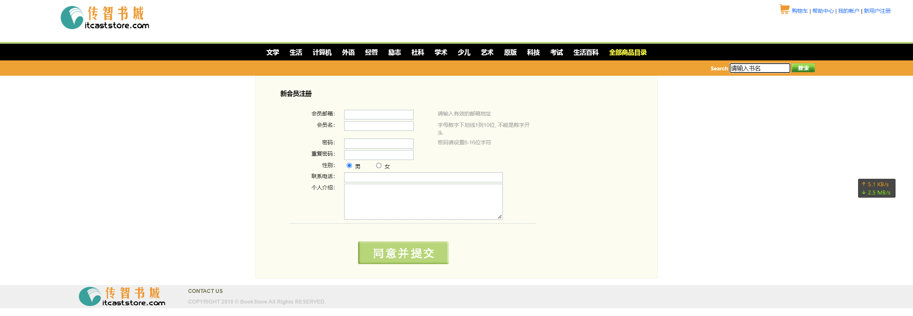
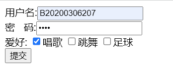

# 实验一：web客户端技术

## 一.实验目的

1. 掌握Dreamweaver、Code等工具的使用
2. 熟悉HTML的常用标记
3. 熟悉CSS选择器和常用属性
4. 掌握HTML+CSS+JavaScript的开发基础

## 二． 实验类型：验证型

---

## 三． 实验学时：12学时

---

## 四． 实验原理及知识点

---

1. HTML的常用标记包括文字与段落，建立列表，图片及多媒体文件的使用，建立超链接，建立表单页面
2. 页面的布局
3. 样式语法，样式属性，样式类
4. 脚本语言语法，HTML DOM模型，事件响应模型。

## 五．实验环境（硬件环境、软件环境）

---

1. 硬件环境：微型电子计算机Intel Pentium 4 CPU 1.2GHz，512MB RAM及以上
2. 软件环境:
   操作系统：Windows 7 以上
   Web服务器：Tomcat 8 以上
   数据库：MySQL 5 以上
   软件工具：Eclipse 4 集成开发工具/IDEA、Chrome浏览器

## 六．实验内容及步骤

---

### **1. 书城首页的实现**

#### **功能**

+ 布局（第一次上机课）
+ 水平菜单栏（第2次上机课）
+ 下拉菜单（第2次上机课）
+ 表格变色（第3次上机课）
+ 广告页轮播（第4次上机课）

#### **效果图**


#### 不使用css的效果图：


### **实验步骤**

**1）.创建资源文件夹
**2).布局****

* 写出HTML的分层各部分
* 为每个层布局，定义背景色和大小、定位（宽度、高度、框模型），局部通过table来设置位置
* divhead 头部区域通过table布局，创建一行两列的表格。

```html
  <!--网页上方的项目-->
<div id = divhead>
    <table cellspacing = "0" class = "headtable"> 
        <tr>
            <td>
                <a href="#">
                    
                </a>
            </td>
            <td style="text-align:right"><!--靠右对齐-->
                 <a href="#">购物车</a>
                <a href="#">帮助中心</a> 
                <a href="#">我的账户</a>
                <a href="register.html"><!--切换注册页面-->注册账户</a>
            </td>
        </tr>
    </table>
</div>
    <!--书店的上方项目结束-->
```

* divmenu菜单项布局

```css
    #divmenu {
	width: 100%;
	border-top-width: 4px;
	border-top-style: solid;
	border-top-color: #b4d76d;
	background-color: #000000;
	text-align: center;
	padding: 10px 0px 10px 0px;
	font-size: 14px;
}
```

* divsearch 一个输入框和一个查找按钮

```html
    <!--搜索书籍-->
<div id="divsearch">
    <form action="#" id="searchform">
        <table width="100%" border="0" cellspacing="0"><!--width为范围-->
            <tr>
                <td style="text-align:right; padding-right:200px">
                    <!--样式中 右内边距定位-->
                    <input type="text" name="textfield" class="inputtable" id="textfield" value="请输入要查找的书名"
                    onmouseover="this.focus();"
                    onclick="my_click(this, 'textfield');"
                    onblur="my_blur(this, 'textfield');" />
                    <a href ="#">
                        
                    </a>
                </td>
            </tr>
        </table>
    </form>
</div>
```


* box_autoplay轮播图 固定宽度和高度，左下角排列按钮

```css
box_autoplay {
    position: relative;
    width: 900px;
    height: 335px;
    background: #fff;
    border-radius: 5px;
    border:8px solid #fff;
	margin:10px auto;
	cursor:pointer;   
}

#box_autoplay .list {
    position: relative;
    width: 900px;
    height: 335px;
    overflow: hidden;
}

#box_autoplay .list ul {
    position: absolute; 
    top: 0;  
    left:0; 
}

#box_autoplay .list li { 
    width:900px; 
    height:335px; 
    overflow:hidden; 
}

#box_autoplay .count li {
	color:#fff;
	float:left;
	width:20px;
	height:20px;
	cursor:pointer;
	margin-right:5px;
	overflow:hidden;
	background:#F90;
	opacity:0.7;
	filter:alpha(opacity=70);
	border-radius:20px;
}

#box_autoplay .count li.current {
	color:#fff;
	opacity:1;
	filter:alpha(opacity=100);
	font-weight:700;
	background:#f60;
}

#tmp {
	width:100px;
	height:100px;
	background:red;
	position:absolute;
}
```

```

```

* divcontent  左边使用文本框，右边插入图片

```css
#divcontent {
    width: 900px;
    background-color: #FCFDEF;
    border: 1px solid #EEEDDB;
    MARGIN-RIGHT: auto;
    MARGIN-LEFT: auto;
    height: 250px;
}
```

* divfoot 底部一张图片和文本

```html
<!--5. 网上书城底部 start -->
<div id="divfoot">
    <table width="100%" border="0" cellspacing="0" >
        <tr>
            <td rowspan="2" style="width:10%">
                
            </td>
            <td style="padding-top:5px; padding-left:50px">
                <a href="#">
                    <font color="#747556"><b>CONTACT US</b></font> 
                </a>
            </td>
        </tr>
        <tr>
            <td style="padding-left:50px">
                <font color="#CCCCCC">
                    <b>COPYRIGHT 2015 © BookStore All Rights RESERVED.</b> 
                </font>
            </td>
        </tr>
    </table>
</div>

<!-- 网上书城底部  end -->

#divfoot {
    width: 100%;
    clear: both;
    background-color: #efefef;
    margin-top: 15px;
}
```

**3).菜单的实现**

```html
    <!--书店菜单-->
<div id="divmenu">
        <a href="#">文学</a>
        <a href="#">数学</a>
        <a href="#">语言</a>
        <a href="#">科学</a>
        <a href="#">悬疑</a>
        <a href="#">科幻</a>
        <a href="#">儿童</a>
        <a href="#">生活</a>
        <a href="#" style="color: red">全部商品目录</a>
    </tr>
</div> 
    <!--书店菜单结束-->
```

* 实现效果图：

**4).下拉菜单**

* 代码如下:

```html
<html>
<head>
    <title>下拉菜单实例</title>
    <script language="JavaScript">
        function show(menu) {
            document.getElementById(menu).style.visibility = "visible";
        }
        function hide() {
            document.getElementById("menu1").style.visibility =
                "hidden";
            document.getElementById("menu2").style.visibility =
                "hidden";
            document.getElementById("menu3").style.visibility = "hidden";
        }
    </script>
</head>
<body>
    <table>
        <tr bgcolor="#9999ff" align="center">
            <td width="120" onmousemove="show('menu1')" onmouseout="hide()">系列课程</td>
            <td width="120" onmousemove="show('menu2')" onmouseout="hide()">教学课件</td>
            <td width="120" onmousemove="show('menu3')" onmouseout="hide()">课程大纲</td>
        </tr>
    </table>
    <div id="menu1" onmousemove="show('menu1')" onmouseout="hide()"
        style="background: #9999ff;position:absolute;left:12px;top:38;width:120;visibility: hidden">
        <span>C++程序设计</span><br />
        <span>Java程序设计</span><br />
        <span>Python程序设计</span><br />
    </div>
    <div id="menu2" onmousemove="show('menu2')" onmouseout="hide()"
        style="background: #9999ff;position:absolute;left:137px;top:38;width:120;visibility: hidden">
        <span>C++课件</span><br />
        <span>Java课件</span><br />
        <span>Python课件</span><br />
    </div>
    <div id="menu3" onmousemove="show('menu3')" onmouseout="hide()"
        style="background: #9999ff;position:absolute;left:260px;top:38;width:120;visibility: hidden">
        <span>C++大纲</span><br />
        <span>Java大纲</span><br />
        <span>Python大纲</span><br />
    </div>
</body>
</html>
```

* 效果图:.png)
  **5).轮播图**
* 代码如下:

```html
    <!--推荐书籍轮播画面-->
<div id="box_autoplay">
    <div class="list">
        <ul>
            <li></li>
            <li></li>
            <li></li>
            <li></li>
            <li></li>
        </ul>
    </div>
</div>
```

* 在js中完成的部分:

```js
//获取ID
var $ = function (id) {return typeof id === "string" ? document.getElementById(id) : id;};
//获取tagName
var $$ = function (tagName, oParent) {return (oParent || document).getElementsByTagName(tagName);};
//自动播放对象
var AutoPlay = function (id) {this.initialize(id);};
AutoPlay.prototype = {
	initialize: function (id)
	{
		var oThis = this;
		this.oBox = $(id);
		this.oUl = $$("ul", this.oBox)[0];
		this.aImg = $$("img", this.oBox);
		this.timer = null;
		this.autoTimer = null;
		this.iNow = 0;
		this.creatBtn();
		this.aBtn = $$("li", this.oCount);
		this.toggle();
		this.autoTimer = setInterval(function ()
		{
			oThis.next();
		}, 3000);
		this.oBox.onmouseover = function ()
		{
			clearInterval(oThis.autoTimer);
		};
		this.oBox.onmouseout = function ()
		{
			oThis.autoTimer = setInterval(function ()
			{
				oThis.next();
			}, 3000);
		};
		for (var i = 0; i < this.aBtn.length; i++)
		{
			this.aBtn[i].index = i;
			this.aBtn[i].onmouseover = function ()
			{
				oThis.iNow = this.index;
				oThis.toggle();
			};
		}
	},
	creatBtn: function ()
	{
		this.oCount = document.createElement("ul");
		this.oFrag = document.createDocumentFragment();
		this.oCount.className = "count";
		for (var i = 0; i < this.aImg.length; i++)
		{
			var oLi = document.createElement("li");
			oLi.innerHTML = i + 1;
			this.oFrag.appendChild(oLi);
		}
		this.oCount.appendChild(this.oFrag);
		this.oBox.appendChild(this.oCount);
	},
	toggle: function ()
	{
		for (var i = 0; i < this.aBtn.length; i++) this.aBtn[i].className = "";
		this.aBtn[this.iNow].className = "current";
		this.doMove(-(this.iNow * this.aImg[0].offsetHeight));
	},
	next: function ()
	{
		this.iNow++;
		this.iNow == this.aBtn.length && (this.iNow = 0);
		this.toggle();
	},
	doMove: function (iTarget)
	{
		var oThis = this;
		clearInterval(oThis.timer);
		oThis.timer = setInterval(function ()
		{
			var iSpeed = (iTarget - oThis.oUl.offsetTop) / 5;
			iSpeed = iSpeed > 0 ? Math.ceil(iSpeed) : Math.floor(iSpeed);
			oThis.oUl.offsetTop == iTarget ? clearInterval(oThis.timer) : (oThis.oUl.style.top = oThis.oUl.offsetTop + iSpeed + "px");
		}, 30);
	}
};
window.onload = function ()
{
	new AutoPlay("box_autoplay");
};
```

**6).表格变色**

* 代码如下:

```html
  <html>
    <head>
        <title>变色表格实例</title>
        <script language="JavaScript">
            function change(row){
                document.getElementById(row).style.backgroundColor='#ccccff';
            }
            function reset(row){
                document.getElementById(row).style.backgroundColor='';
            }
        </script>
    </head>
    <body>
        <table width='200px' border="1" cellpadding="1" align="=center">
            <tr><th><学习/th><th>专业</th><th>人数</th></tr>
            <tr align="center" id="row1" onmouseover="change('row1')" 
            onmouseout="reset('row1')"><td>北大</td><td>数学</td><td>2000</td></tr>
            <tr align="center" id="row2" onmouseover="change('row2')" 
            onmouseout="reset('row2')"><td>清华</td><td>计算机</td><td>5000</td></tr>
            <tr align="center" id="row3" onmouseover="change('row3')" 
            onmouseout="reset('row3')"><td>北邮</td><td>电子工程</td><td>2400</td></tr>
            <tr align="center" id="row4" onmouseover="change('row4')" 
            onmouseout="reset('row4')"><td>复旦</td><td>新闻</td><td>3000</td></tr>

        </table>
    </body>
</html>
```

* 效果图:

  
* # 实验二：注册页面的实现

  ## 一.实验目的


  1. 掌握Dreamweaver、Code等工具的使用
  2. 熟悉HTML的常用标记
  3. 熟悉CSS选择器和常用属性
  4. 掌握HTML+CSS+JavaScript的开发基础

  ## 二． 实验类型：验证型

  ---

  ## 三． 实验学时：12学时

  ---

  ## 四． 实验原理及知识点

  ---

  1. 设计一个用户注册的页面
  2. 实现表单校验功能
  3. 采用Bootstrap框架实现注册页面

  ## 五．实验环境（硬件环境、软件环境）

  ---

  1. 硬件环境：微型电子计算机Intel Pentium 4 CPU 1.2GHz，512MB RAM及以上
  2. 软件环境:
     操作系统：Windows 7 以上
     Web服务器：Tomcat 8 以上
     数据库：MySQL 5 以上
     软件工具：Eclipse 4 集成开发工具/IDEA、Chrome浏览器

  ## 六．实验内容及步骤

  ### 创建register.html注册页面

  代码：

  ```html
  <div id="divcontent" align="center">
  		<form action="registersuccess.html" method="post" onsubmit="return checkForm();">
  			<table width="850px" border="0" cellspacing="0">
  				<tr>
  					<td style="padding: 30px"><h1>新会员注册</h1>
  						<table width="70%" border="0" cellspacing="2" class="upline">
  							<tr>
  								<td style="text-align: right; width: 20%">会员邮箱：</td>
  								<td style="width: 40%">
  								<input type="text" class="textinput"  id="email" name="email" onkeyup="checkEmail();"/>
  								</td>
  								<td colspan="2"><span id="emailMsg"></span><font color="#999999">请输入有效的邮箱地址</font></td>
  							</tr>
  							<tr>
  								<td style="text-align: right">会员名：</td>
  								<td><input type="text" class="textinput"  id="username" name="username" onkeyup="checkUsername();"/>
  								</td>
  								<td colspan="2"><span id="usernameMsg"></span><font color="#999999">字母数字下划线1到10位, 不能是数字开头</font></td>
  							</tr>
  							<tr>
  								<td style="text-align: right">密码：</td>
  								<td><input type="password" class="textinput"  id="password" name="password" onkeyup="checkPassword();"/></td>
  								<td><span id="passwordMsg"></span><font color="#999999">密码请设置6-16位字符</font></td>
  							</tr>
  							<tr>
  								<td style="text-align: right">重复密码：</td>
  								<td>
  								<input type="password" class="textinput"  id="repassword" name="repassword" onkeyup="checkConfirm();"/>
  								</td>
  								<td><span id="confirmMsg"></span> </td>
  							</tr>
  							<tr>
  								<td style="text-align: right">性别：</td>
  								<td colspan="2">  
                                  <input type="radio" name="gender" value="男" checked="checked" /> 男
  									       
  									<input type="radio" name="gender" value="女" /> 女
  								</td>
  								<td> </td>
  							</tr>
  							<tr>
  								<td style="text-align: right">联系电话：</td>
  								<td colspan="2">
  								<input type="text" class="textinput"
  									style="width: 350px" name="telephone" />
  								</td>
  								<td> </td>
  							</tr>
  							<tr>
  								<td style="text-align: right">个人介绍：</td>
  								<td colspan="2">
  								<textarea class="textarea" name="introduce"></textarea>
  								</td>
  								<td> </td>
  							</tr>
  						</table>

  						<table width="70%" border="0" cellspacing="0">
  							<tr>
  								<td style="padding-top: 20px; text-align: center">
  									<input type="image" src="images/signup.gif" name="submit" border="0"/>
  								</td>
  							</tr>
  						</table>
  					</td>
  				</tr>
  			</table>
  		</form>
  	</div>
  ```

  ### 创建form.js文件，实现表单校验功能

  ```js
  var emailObj;
  var usernameObj;
  var passwordObj;
  var confirmObj;

  var emailMsg;
  var usernameMsg;
  var passwordMsg;
  var confirmMsg;

  window.onload = function() {	// 页面加载之后, 获取页面中的对象
  	emailObj = document.getElementById("email");
  	usernameObj = document.getElementById("username");
  	passwordObj = document.getElementById("password");
  	confirmObj = document.getElementById("repassword");

  	emailMsg = document.getElementById("emailMsg");
  	usernameMsg = document.getElementById("usernameMsg");
  	passwordMsg = document.getElementById("passwordMsg");
  	confirmMsg = document.getElementById("confirmMsg");
  };

  function checkForm() {			// 验证整个表单
  	var bEmail = checkEmail();
  	var bUsername = checkUsername();
  	var bPassword = checkPassword();
  	var bConfirm = checkConfirm();
  	return bUsername && bPassword && bConfirm && bEmail ;	// return false后, 事件将被取消
  }

  function checkEmail() {			// 验证邮箱
  	var regex = /^[\w-]+@([\w-]+\.)+[a-zA-Z]{2,4}$/;
  	var value =emailObj.value;
  	var msg = "";
  	if (!value)
  		msg = "邮箱必须填写：";
  	else if (!regex.test(value))
  		msg = "邮箱格式不合法：";
  	emailMsg.innerHTML = msg;
  	emailObj.parentNode.parentNode.style.color = msg == "" ? "black" : "red";
  	return msg == "";
  }

  function checkUsername() {		// 验证用户名
  	var regex = /^[a-zA-Z_]\w{0,9}$/;	// 字母数字下划线1到10位, 不能是数字开头
  	var value = usernameObj.value;// 获取usernameObj中的文本
  	var msg = "";						// 最后的提示消息, 默认为空
  	if (!value)							// 如果用户名没填, 填了就是一个字符串可以当作true, 没填的话不论null或者""都是false
  		msg = "用户名必须填写：";			// 改变提示消息
  	else if (!regex.test(value))		// 如果用户名不能匹配正则表达式规则
  		msg = "用户名不合法：";			// 改变提示消息
  	usernameMsg.innerHTML = msg;		// 将提示消息放入SPAN
  	usernameObj.parentNode.parentNode.style.color = msg == "" ? "black" : "red";	// 根据消息结果改变tr的颜色
  	return msg == "";					// 如果提示消息为空则代表没出错, 返回true
  }

  function checkPassword() {		// 验证密码
  	var regex = /^.{6,16}$/;			// 任意字符, 6到16位
  	var value = passwordObj.value;
  	var msg = "";
  	if (!value)
  		msg = "密码必须填写：";
  	else if (!regex.test(value))
  		msg = "密码不合法：";
  	passwordMsg.innerHTML = msg;
  	passwordObj.parentNode.parentNode.style.color = msg == "" ? "black" : "red";
  	return msg == "";
  }

  function checkConfirm() {		// 验证确认密码
  	var passwordValue = passwordObj.value;
  	var confirmValue = confirmObj.value;
  	var msg = "";

      if(!confirmValue){
  	    msg = "确认密码必须填写";
  	}
  	else	if (passwordValue != confirmValue){
  		msg = "密码必须保持一致";
      }
  	confirmMsg.innerHTML = msg;
  	confirmObj.parentNode.parentNode.style.color = msg == "" ? "black" : "red";
  	return msg == "";
  }
  ```

  ## 实现图

  

# 实验三：Web服务器端技术

#### 一．实验目的

1. **掌握在IDEA中配置Tomcat服务器的方法**
2. **掌握Servlet的工作原理及运行和配置方法**
3. **掌握Servlet获取请求参数的方法、Servlet实现转发请求的方法**
4. **熟悉使用Session对象实现购物车和用户登录功能**
5. **熟悉JSP指令和隐式对象的使用**
6. **熟悉JSTL中常用的Core标签库**
7. **掌握使用Filter实现用户自动登录和实现统一全站编码以及监听器监听域对象的生命周期的属性变**
   **更**
8. **掌握JDBC操作数据库的步骤**
9. **熟悉通过数据源获取数据库连接的方法**
10. **熟悉使用JSP Model2的思想开发程序**

#### 二．实验类型：验证型

#### 三．实验学时：20学时

#### 四．实验原理及知识点

1. **Servlet的生命周期方法**
2. **请求和响应对象的含义和应用、Servlet获取请求参数的方法、Servlet实现转发请求的方法**
3. **Cookie对象和Session对象的使用**
4. **JSP的基本语法**
5. **JavaBean、EL表达式和JSTL标签库**
6. **Filter过滤器、Listener监听器**
7. **JDBC的常用API**
8. **数据库连接池**
9. **MVC设计模式**
10. **10.Ajax**

#### 五．实验环境（硬件环境、软件环境）

1. **硬件环境：微型电子计算机Intel Pentium 4 CPU 1.2GHz，512MB RAM及以上**
2. **软件环境：**
   **操作系统：Windows 7 以上**
   **Web服务器：Tomcat 8 以上**
   **数据库：MySQL 5 以上**
   **软件工具：Eclipse 4 集成开发工具/IDEA、Chrome浏览器**
   **六．实验内容及步骤**
   **1.了解Maven**
3. **Servlet的用法：使用IDEA新建Maven Web工程，新建一个**
   **Servlet，在客户端输出 Hello World，跟踪生命周期三个阶段，理解注解工作原理。**

#### 六.输出Hello Word

```java
package com.example.demo2;

import java.io.*;
import javax.servlet.http.*;
import javax.servlet.annotation.*;

@WebServlet(name = "helloServlet", value = "/hello-servlet")
public class HelloServlet extends HttpServlet {
    private String message;

    public void init() {
        message = "Hello World!";
    }

    public void doGet(HttpServletRequest request, HttpServletResponse response) throws IOException {
        response.setContentType("text/html");

        // Hello
        PrintWriter out = response.getWriter();
        out.println("<html><body>");
        out.println("<h1>" + message + "</h1>");
        out.println("</body></html>");
    }

    public void destroy() {
    }
}
```

* **实现效果图：**

  

#### 七.跟踪生命周期三阶段

```
import java.io.*;
import javax.servlet.http.*;
import javax.servlet.annotation.*;

@WebServlet(name = "helloServlet", value = "/hello-servlet")
public class HelloServlet extends HttpServlet {
    private String message;

    public void init() {
        message = "Hello World!";
    }

    public void doGet(HttpServletRequest request, HttpServletResponse response) throws IOException {
        response.setContentType("text/html");

        // Hello
        PrintWriter out = response.getWriter();
        out.println("<html><body>");
        out.println("<h1>" + message + "</h1>");
        out.println("</body></html>");
    }

    public void destroy() {
    }
}
```

#### 八.解决中文乱码问题

### 1.html页面

```
在页面的<head>标签内添加<meta>标签
<meta http-equiv="Content-Type" content="text/htmlcharset=UTF-8">
或者
<meta charset="utf-8">
```

### 2.jsp页面

```
在jsp页面的顶部加上以下代码
<%@ page language="java" contentType="text/html; charset=UTF-8" pageEncoding="UTF-8"%>
同时在<head>标签下添加<meta>标签
<meta http-equiv="Content-Type" content="text/html; charset=UTF-8">
```

**package com.example.home4;**

**import java.io.***;**
**import javax.servlet.http.*;**
**import javax.servlet.annotation.*;

**@WebServlet(name = "helloServlet", value = "/hello-servlet")**
**public class HelloServlet extends HttpServlet {**
**    private String message;**

```
public void init() {
    message = "你好!";
}

public void doGet(HttpServletRequest request, HttpServletResponse response) throws IOException {
    response.setContentType("text/html");

    // Hello
    PrintWriter out = response.getWriter();
    out.println("<html><body>");
    out.println("<h1>" + message + "</h1>");
    out.println("</body></html>");
}

public void destroy() {
}
```

**}**
**乱码效果图：**


**解决乱码之后效果图：**


#### 九.总结

**通过这次实验学会了使用idea，并且将tomcat添加到idea中，可以在客户端中输出想输出的东西。并且理解了生命周期。**
**如果出现了乱码的情况，也不要着急，先冷静分析，乱码是出现在哪一个环节，然后通过对应的方法解决**

## 实验三

### 一.请求重定向

#### login.html:

```
<!DOCTYPE html PUBLIC "-//W3C//DTD HTML 4.01 Transitional//EN"
        "http://www.w3.org/TR/html4/loose.dtd">
<html>
<head>
    <meta http-equiv="Content-Type" content="text/html; charset=UTF-8">
    <title>Insert title here</title>
</head>
<body>
<!--把表单内容提交到chapter04中的LoginServlet-->
<form action="/home4_war_exploded/LoginServlet" method="post">
    用户名:<input type="text" name="username" /><br />
    密   码:<input type="password" name="password" /><br />
    <input type="submit" value="登录">
</form>
</body>
</html>
```

#### welcome.html

```
<!DOCTYPE html PUBLIC "-//W3C//DTD HTML 4.01 Transitional//EN"
        "http://www.w3.org/TR/html4/loose.dtd">
<html>
<head>
    <meta http-equiv="Content-Type" content="text/html; charset=UTF-8">
    <title>Insert title here</title>
</head>
<body>
欢迎你，登录成功!
</body>
</html>
```

#### LoginServlet:

```
package com.example.home4;

import javax.servlet.ServletException;
import javax.servlet.annotation.WebServlet;
import javax.servlet.http.HttpServlet;
import javax.servlet.http.HttpServletRequest;
import javax.servlet.http.HttpServletResponse;
import java.io.IOException;

@WebServlet(name = "LoginServlet", urlPatterns = "/LoginServlet")
public class LoginServlet extends HttpServlet {
    public void doGet(HttpServletRequest request, HttpServletResponse response)
            throws ServletException, IOException{
        response.setContentType("text/html;charset=utf-8");
        //
        String username = request.getParameter("username");
        String password = request.getParameter("password");
        //
        if(("abc").equals(username) &&("123").equals(password)){
            //
            response.sendRedirect("/home4_war_exploded/welcome.html");
        }
        else{
            response.sendRedirect("/home4_war_exploded/login.html");
        }
    }
    public void doPost(HttpServletRequest request, HttpServletResponse response)
            throws ServletException, IOException {
        doGet(request,response);
    }
}
```

**用户名和密码输入正确后跳转welcome.html页面：**


**输入错误回到登录界面login.html:**


### 二.RequestDispatcher实现请求转发，并利用request传递数据

#### RequestForwardServlet:

```
package com.example.home4;


import javax.servlet.RequestDispatcher;
import javax.servlet.ServletException;
import javax.servlet.annotation.WebServlet;
import javax.servlet.http.HttpServlet;
import javax.servlet.http.HttpServletRequest;
import javax.servlet.http.HttpServletResponse;
import java.io.IOException;

@WebServlet(name = "RequestForwardServlet",urlPatterns = "/RequestForwardServlet")
public class RequestForwardServlet extends HttpServlet {
    public void doGet(HttpServletRequest request, HttpServletResponse response)
            throws ServletException,IOException{
        response.setContentType("text/html;charset=utf-8");
        request.setAttribute("username","张三");
        RequestDispatcher dispatcher = request.getRequestDispatcher("/ResultServlet");
        dispatcher.forward(request,response);
    }
    public void doPost(HttpServletRequest request, HttpServletResponse response)
            throws ServletException,IOException {
        doGet(request,response);
    }
}
```

#### ResultServlet:

```
package com.example.home4;

import javax.servlet.ServletException;
import javax.servlet.annotation.WebServlet;
import javax.servlet.http.HttpServlet;
import javax.servlet.http.HttpServletRequest;
import javax.servlet.http.HttpServletResponse;
import java.io.IOException;
import java.io.PrintWriter;

@WebServlet(name = "ResultServlet",urlPatterns = "/ResultServlet")
public class ResultServlet extends HttpServlet {
    public void doGet(HttpServletRequest request, HttpServletResponse response)
            throws ServletException, IOException {
        response.setContentType("text/html;charset=utf-8");
        PrintWriter out = response.getWriter();
        String username = (String)request.getAttribute("username");
        if(username!=null){
            out.println("用户名:"+username+"<br/>");
        }
    }
    public void doPost(HttpServletRequest request, HttpServletResponse response)
            throws ServletException,IOException {
        doGet(request,response);
    }
}
```

**运行效果图:**

### 三.获取请求参数:

#### RequestParamsServlet：

```
package com.example.home4;

import javax.servlet.ServletException;
import javax.servlet.annotation.WebServlet;
import javax.servlet.http.HttpServlet;
import javax.servlet.http.HttpServletRequest;
import javax.servlet.http.HttpServletResponse;
import java.io.IOException;

@WebServlet(name = "RequestParamsServlet",urlPatterns = "/RequestParamsServlet")
public class RequestParamsServlet extends HttpServlet {
    public void doGet(HttpServletRequest request, HttpServletResponse response)
            throws ServletException, IOException {
        request.setCharacterEncoding("utf-8");
        String name = request.getParameter("username");
        String password = request.getParameter("password");

        System.out.println("用户名:" + name);
        System.out.println("密 码:" + password);

        String[] hobbys = request.getParameterValues("hobby");
        System.out.println("爱好:");
        for (int i = 0; i < hobbys.length; i++) {
            System.out.println(hobbys[i] + ",");
        }
    }
    public void doPost(HttpServletRequest request, HttpServletResponse response)
            throws ServletException,IOException {
        doGet(request,response);
    }

}
```

#### form.html:

```
<!DOCTYPE html PUBLIC "-//W3C//DTD HTML 4.01 Transitional//EN"
        "http://www.w3.org/TR/html4/loose.dtd">
<html>
<head>
    <meta http-equiv="Content-Type" content="text/html; charset=UTF-8">
    <title>Insert title here</title>
</head>
<body>
<form action="/home4_war_exploded/RequestParamsServlet" method="post">
    用户名:<input type="text" name="username" /><br />
    密   码:<input type="password" name="password" /><br />
    爱好:
    <input type="checkbox" name="hobby" value="sing">唱歌
    <input type="checkbox" name="hobby" value="dance">跳舞
    <input type="checkbox" name="hobby" value="football">足球<br />
    <input type="submit" value="提交">
</form>
</body>
</html>
```

**运行效果图：**


## 总结

**学习到了许多知识，在这次实验知道了如何实现servlet之间的相互跳转，获取请求参数**
