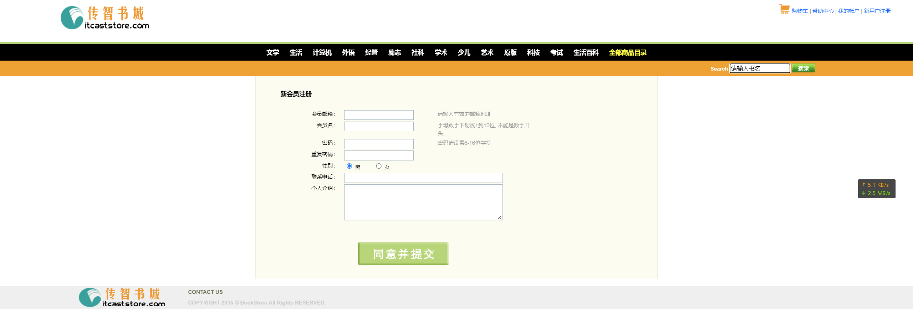

# 实验二：注册页面的实现

## 一.实验目的

1. 掌握Dreamweaver、Code等工具的使用
2. 熟悉HTML的常用标记
3. 熟悉CSS选择器和常用属性
4. 掌握HTML+CSS+JavaScript的开发基础

## 二． 实验类型：验证型

---

## 三． 实验学时：12学时

---

## 四． 实验原理及知识点

---

1. 设计一个用户注册的页面
2. 实现表单校验功能
3. 采用Bootstrap框架实现注册页面

## 五．实验环境（硬件环境、软件环境）

---

1. 硬件环境：微型电子计算机Intel Pentium 4 CPU 1.2GHz，512MB RAM及以上
2. 软件环境:
   操作系统：Windows 7 以上
   Web服务器：Tomcat 8 以上
   数据库：MySQL 5 以上
   软件工具：Eclipse 4 集成开发工具/IDEA、Chrome浏览器

## 六．实验内容及步骤

### 创建register.html注册页面

代码：

```html
<div id="divcontent" align="center">
		<form action="registersuccess.html" method="post" onsubmit="return checkForm();">
			<table width="850px" border="0" cellspacing="0">
				<tr>
					<td style="padding: 30px"><h1>新会员注册</h1>
						<table width="70%" border="0" cellspacing="2" class="upline">
							<tr>
								<td style="text-align: right; width: 20%">会员邮箱：</td>
								<td style="width: 40%">
								<input type="text" class="textinput"  id="email" name="email" onkeyup="checkEmail();"/>
								</td>
								<td colspan="2"><span id="emailMsg"></span><font color="#999999">请输入有效的邮箱地址</font></td>
							</tr>
							<tr>
								<td style="text-align: right">会员名：</td>
								<td><input type="text" class="textinput"  id="username" name="username" onkeyup="checkUsername();"/>
								</td>
								<td colspan="2"><span id="usernameMsg"></span><font color="#999999">字母数字下划线1到10位, 不能是数字开头</font></td>
							</tr>
							<tr>
								<td style="text-align: right">密码：</td>
								<td><input type="password" class="textinput"  id="password" name="password" onkeyup="checkPassword();"/></td>
								<td><span id="passwordMsg"></span><font color="#999999">密码请设置6-16位字符</font></td>
							</tr>
							<tr>
								<td style="text-align: right">重复密码：</td>
								<td>
								<input type="password" class="textinput"  id="repassword" name="repassword" onkeyup="checkConfirm();"/>
								</td>
								<td><span id="confirmMsg"></span> </td>
							</tr>
							<tr>
								<td style="text-align: right">性别：</td>
								<td colspan="2">  
                                <input type="radio" name="gender" value="男" checked="checked" /> 男
									       
									<input type="radio" name="gender" value="女" /> 女
								</td>
								<td> </td>
							</tr>
							<tr>
								<td style="text-align: right">联系电话：</td>
								<td colspan="2">
								<input type="text" class="textinput"
									style="width: 350px" name="telephone" />
								</td>
								<td> </td>
							</tr>
							<tr>
								<td style="text-align: right">个人介绍：</td>
								<td colspan="2">
								<textarea class="textarea" name="introduce"></textarea>
								</td>
								<td> </td>
							</tr>
						</table>

						<table width="70%" border="0" cellspacing="0">
							<tr>
								<td style="padding-top: 20px; text-align: center">
									<input type="image" src="images/signup.gif" name="submit" border="0"/>
								</td>
							</tr>
						</table>
					</td>
				</tr>
			</table>
		</form>
	</div>
```

### 创建form.js文件，实现表单校验功能

```js
var emailObj;
var usernameObj;
var passwordObj;
var confirmObj;

var emailMsg;
var usernameMsg;
var passwordMsg;
var confirmMsg;

window.onload = function() {	// 页面加载之后, 获取页面中的对象
	emailObj = document.getElementById("email");
	usernameObj = document.getElementById("username");
	passwordObj = document.getElementById("password");
	confirmObj = document.getElementById("repassword");

	emailMsg = document.getElementById("emailMsg");
	usernameMsg = document.getElementById("usernameMsg");
	passwordMsg = document.getElementById("passwordMsg");
	confirmMsg = document.getElementById("confirmMsg");
};

function checkForm() {			// 验证整个表单
	var bEmail = checkEmail();
	var bUsername = checkUsername();
	var bPassword = checkPassword();
	var bConfirm = checkConfirm();
	return bUsername && bPassword && bConfirm && bEmail ;	// return false后, 事件将被取消
}

function checkEmail() {			// 验证邮箱
	var regex = /^[\w-]+@([\w-]+\.)+[a-zA-Z]{2,4}$/;
	var value =emailObj.value;
	var msg = "";
	if (!value)
		msg = "邮箱必须填写：";
	else if (!regex.test(value))
		msg = "邮箱格式不合法：";
	emailMsg.innerHTML = msg;
	emailObj.parentNode.parentNode.style.color = msg == "" ? "black" : "red";
	return msg == "";
}

function checkUsername() {		// 验证用户名
	var regex = /^[a-zA-Z_]\w{0,9}$/;	// 字母数字下划线1到10位, 不能是数字开头
	var value = usernameObj.value;// 获取usernameObj中的文本
	var msg = "";						// 最后的提示消息, 默认为空
	if (!value)							// 如果用户名没填, 填了就是一个字符串可以当作true, 没填的话不论null或者""都是false
		msg = "用户名必须填写：";			// 改变提示消息
	else if (!regex.test(value))		// 如果用户名不能匹配正则表达式规则
		msg = "用户名不合法：";			// 改变提示消息
	usernameMsg.innerHTML = msg;		// 将提示消息放入SPAN
	usernameObj.parentNode.parentNode.style.color = msg == "" ? "black" : "red";	// 根据消息结果改变tr的颜色
	return msg == "";					// 如果提示消息为空则代表没出错, 返回true
}

function checkPassword() {		// 验证密码
	var regex = /^.{6,16}$/;			// 任意字符, 6到16位
	var value = passwordObj.value;
	var msg = "";
	if (!value)
		msg = "密码必须填写：";
	else if (!regex.test(value))
		msg = "密码不合法：";
	passwordMsg.innerHTML = msg;
	passwordObj.parentNode.parentNode.style.color = msg == "" ? "black" : "red";
	return msg == "";
}

function checkConfirm() {		// 验证确认密码
	var passwordValue = passwordObj.value;
	var confirmValue = confirmObj.value;
	var msg = "";

    if(!confirmValue){
	    msg = "确认密码必须填写";
	}
	else	if (passwordValue != confirmValue){
		msg = "密码必须保持一致";
    }
	confirmMsg.innerHTML = msg;
	confirmObj.parentNode.parentNode.style.color = msg == "" ? "black" : "red";
	return msg == "";
}
```


## 实现图


